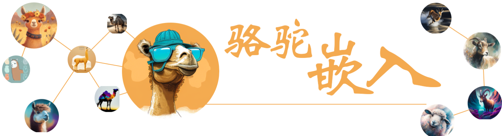
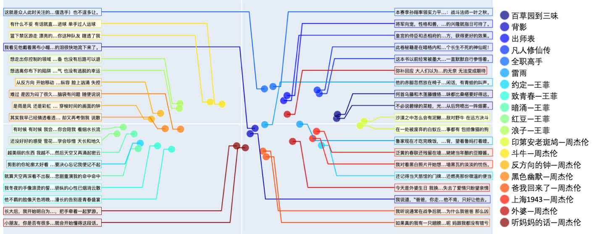
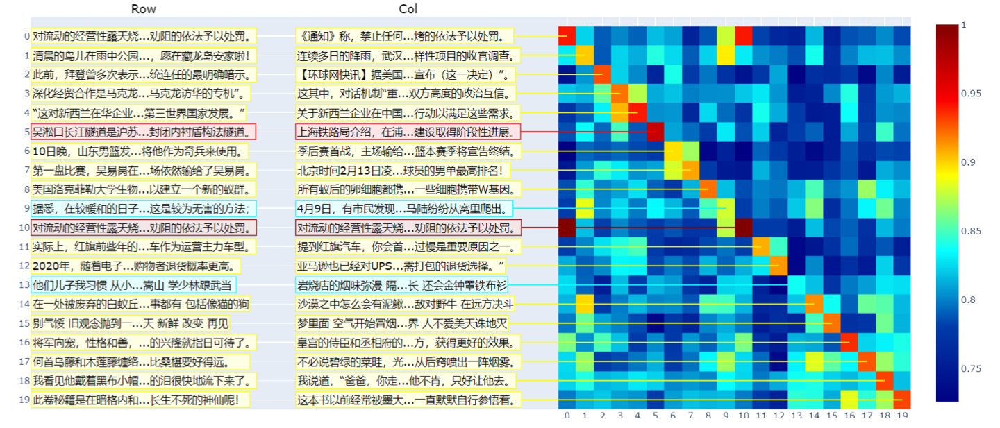
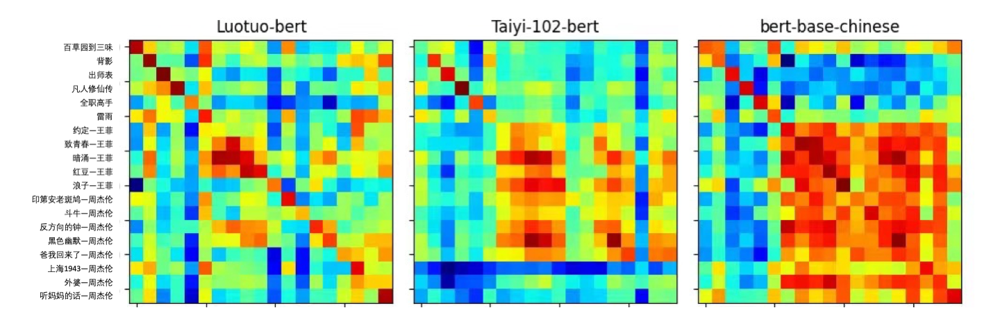
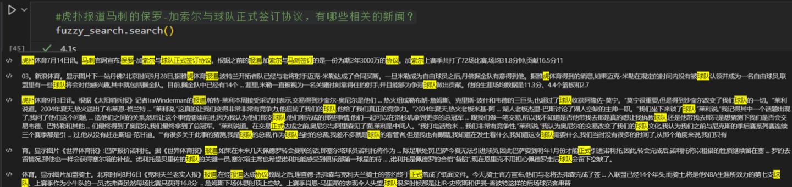
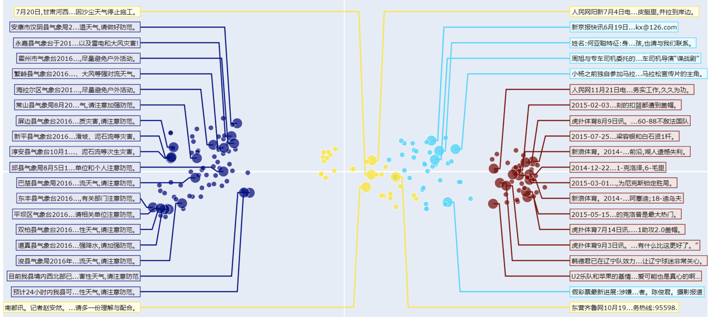

<a name="BigTitle"></a>

English | [快速上手](#quickstart) | [Embedding应用](#application) | [数据](#data) | [赞助](#sponsorship) | [人员](#contributor) | [引用](#cite) | [鲁叔的讨论](#discussion)

# Luotuo Embedding 骆驼嵌入: Generative Text Embedding Model distilled from OpenAI API

骆驼嵌入是一个文本嵌入(text embedding)模型，由冷子昂, 刘思诣, 黄泓森, 陈舒年, 胡婧, 孙骜, 陈启源, 李鲁鲁等开发

<details>
  <summary> 每个作者都是第一作者，顺序是随机的。(点这里具体)</summary>

李鲁鲁发起了项目，并完成了初步的验证，提出了KL散度Loss和Hard Negative挖掘。

刘思诣完成了初步训练框架的编写，以及支撑了后面模型上传到hugging face管线。

冷子昂完成了完整的大模型和小模型的训练，包括载入数据和损失函数的实现。

陈启源准备了CNewSum的数据，做了句子切分。

黄泓森负责爬取了OpenAI Embedding的数据。

陈舒年完成了重要的几个可视化。

孙骜（即将）用我们的得到的Embedding，完成CoT的提升实验。

胡婧收集了周杰伦的歌词，并（即将）完成更多的定量实验。

</details>

骆驼嵌入是[Luotuo(骆驼)](https://github.com/LC1332/Luotuo-Chinese-LLM)的子项目之一, 后者由李鲁鲁, 冷子昂, 陈启源发起。

<p align="center">
    
</p>

文本嵌入，是指将一段文本，转化为一定维度的向量（1536维），其中相近语义、相关主题的文本在向量空间更接近。拥有一个良好的文本嵌入特征，对于文本可视化、检索、聚类、内容审核等下游任务，有着重要的意义。

+ If you find this helpful, please star our major repo [Luotuo(骆驼)](https://github.com/LC1332/Luotuo-Chinese-LLM), Thanks Very Much

+ 如果你感到这个页面对你有帮助，拜托您去我们[骆驼的主页](https://github.com/LC1332/Luotuo-Chinese-LLM)也点上star，非常感谢！

<a name="quickstart"></a>

## 快速上手

中模型已经发布，大模型将看后面什么时候有空再发布。

|  | Colab链接 | 细节 |
| --- | --- | :--- |
| 小模型 | <a href="https://colab.research.google.com/github/LC1332/Luotuo-Text-Embedding/blob/main/notebook/Luotuo_Embedding_Visualization.ipynb" target="_parent"></a>  | BERT 110M带可视化验证 |
| 中模型 | <a href="https://colab.research.google.com/github/LC1332/Luotuo-Text-Embedding/blob/main/notebook/Luotuo_Embedding_Visualization_Medium.ipynb" target="_parent"></a>  | BERT 352M带可视化验证 |
| 大模型 | - | GLM-Encoder模型带可视化验证 |
| 小模型Minimal | <a href="https://colab.research.google.com/github/LC1332/Luotuo-Text-Embedding/blob/main/notebook/Luotuo_Embedding_Demo.ipynb" target="_parent"></a>  | BERT 110M最简代码 |
| 中模型Minimal | <a href="https://colab.research.google.com/github/LC1332/Luotuo-Text-Embedding/blob/main/notebook/Luotuo_Medium_Embedding_Demo.ipynb" target="_parent"></a> | BERT 352M最简代码 |
| 大模型Minimal | - | GLM-Encoder模型最简代码 |


<a name="application"></a>

## Embedding应用

所有的应用例子都可以在colab链接 <a href="https://colab.research.google.com/github/LC1332/Luotuo-Text-Embedding/blob/main/notebook/Luotuo_Embedding_Visualization.ipynb" target="_parent"></a> 中体验。

- [文本数据可视化](#sec-visual) 任意文本分类数据的可视化

- [文本相关性测试](#sec-CSE) 周杰伦歌词之间的相关性测试。

- [文本的模糊搜索](#sec-IR) 周鸿祎为什么喜欢穿红衣？

- [文本聚类](#sec-grouping) 找呀找呀找朋友

- [少样本的分类学习](#sec-classificationg) 用embedding解决审核任务


<a name="sec-visual"></a>

### 文本数据可视化


对于任意多类的数据，围绕我们发布的Embedding模型，我们准备了一个特殊的可视化代码，可以将类别展示在二维平面，并抽样展示部分文本的内容。你可以直接在 大模型链接 / 小模型链接 中 运行体验。

<p align="center">
    
</p>

通过可视化看我们可以看到，OpenAI原论文的基本假设基本得到验证，即使是很写意的歌词，在中间切开，去除重复文本之后。前段歌词和后段歌词仍然能够呈现很强的相关性。（除了周杰伦的《外婆》，其他的）歌曲的前后段在特征空间中都很接近。

<a name="sec-CSE"></a>

### 文本相关性测试

在OpenAI的论文(补充引用)中，使用了大量文本（补充数量）来进行自监督学习。其关键假设是，在切开的文本中，连续的两段长文本是相关的。在这个应用中，我们会在两个测试上验证这个假设。因为我们目前版本的模型的训练数据都是新闻，我们想找两批不同领域的语料，来验证模型的能力。

+ 网文新闻数据: 我们选取了15篇网文，并且加上了15篇数据集中不覆盖的新闻数据。并且寻找语料中的大段落，进行前后的切分。在网文数据中，为了增加挑战性，我们避免切分前后的数据出现过多重复的词汇。

+ 周杰伦挑战: 由于新闻数据前后文中会有一定数量重复的词汇，而网文叙述的连贯性也很强。所以我们想做一个更难的挑战，我们选取了3篇中学课文，2篇网文，5首王菲的歌，以及8首不同内容的周杰伦的歌。并且在这个挑战中，切分后的前文和后文中，我们人工去除了重复的短句（如副歌），并避免重复的词汇。

下面是周杰伦的第一张专辑中，一首Acid爵士风格的叙事歌曲《印第安老斑鸠》在切分后的前后歌词

```
前半句:沙漠之中怎么会有泥鳅 话说完飞过一只海鸥 大峡谷的风呼啸而过 是谁说没有 有一条热昏头的响尾蛇 无力的躺在干枯的河 在等待雨季来临变沼泽 灰狼啃食着水鹿的骨头 秃鹰盘旋死盯着腐肉 草原上两只敌对野牛 在远方决斗

后半句:在一处被废弃的白蚁丘 站着一只饿昏的老斑鸠 印地安老斑鸠腿短毛不多 几天都没有喝水也能活 脑袋瓜有一点秀逗 猎物死了它比谁都难过 印地安斑鸠 会学人开口 仙人掌怕羞 蜥蝪横着走 这里什么奇怪的事都有 包括像猫的狗
```

<p align="center">
    
</p>

#### 网文新闻测试

我们对Luotuo-BERT在网文新闻30对的数据上进行了测试。我们额外编写了一个可视化，除了热图的展示，我们还抽样展示了热图中涉及数据的文本信息。可以看到

1. OpenAI论文的假设被基本验证。即一个文本的前段和后段呈现很强的相关性

2. 由于我们的模型是在新闻上训练的，当前在新闻的表现上更好。

3. 对于不同domain的文本，相关性矩阵会呈现分块对角的形式，甚至在不同类型的新闻，不同类型的网文之间，也有这样的特点。

3. 根据我们的测试，当前的模型在其他domain的文本上，也能体现出良好的相关性。如果进一步补充其他领域的训练文本，可以使得这个特征有更好的不同领域的适应能力。


#### 周杰伦挑战

在周杰伦挑战中，我们对比了我们训练之前的基础模型，沈向洋老师IDEA团队的Tai-102M的BERT，以及我们训练后的Luotuo-BERT的结果，同时我们还展示了Hugging Face默认的BERT-base-Chinese模型的结果。（更大BERT的结果将在周一放出）

周杰伦挑战的图见一开始tSNE可视化。

<p align="center">
    
</p>

观察下图我们可以得出几个结论

1. 相比于网文新闻测试，歌词测试要难得多。即使是人类来观察前后文本，也很难看出明显的相关性。

2. 有一些同歌手、相近主题的歌曲，会出现分块相关的情况。

3. 我们也对比了OpenAI的结果，通过蒸馏学习，我们的LuotuoBERT已经能够达到和OpenAI的API competitive的结果，所以我们后续考虑在KL散度Loss中，进一步加强对角先验，而不是单纯只考虑OpenAI的结构为目标概率。

更多的对比结果我们将发布在我们正在编写的[报告](./report.md)中。

<a name="sec-IR"></a>

### 模糊问题搜索

在我们的初步测试中，LuotuoBERT已经有很强的模糊文本搜索的能力。

<p align="center">
    
</p>

当然，一个更严肃的模糊搜索应该进一步建立Query特征到Answer文本的关联映射，并适当考虑传统关键词的技术。

<a name="sec-grouping"></a>

### 文本聚类

在不给定类别标签的时候，我们的可视化工具也会自动对文本进行聚类。


<p align="center">
    
</p>

这是一个在新闻数据上进行聚类的展示。


<a name="sec-classification"></a>

### 少样本的分类学习

+ TODO

## 例子代码

## 训练方法

在训练中我们使用了三项Loss， 第一项是对OpenAI的feature求MSE的Loss（其实我估计L1更好）; 第二项是CSE Loss，也就是对文本对求相似度矩阵之后，横向和纵向，以对角为ground truth标签，求cross entropy; 第三项是KL散度的loss，对openAI得到的相关性矩阵P，和模型当前得到的相关性矩阵Q，按行和列分别求KL散度。

具体的内容可以看我们正在编写的[报告](./report.md)，等定量实验完成一些后，我们会先挂出中文的arxiv，方便大家引用我们的工作。补充更多定量实验之后，我会翻译成英文。

### BERT模型

对于BERT模型，我们增加了一个全连接层使得BERT的特征能够提升到1536维，并且使用沈向洋老师IDEA发布的中文CLIP模型为起点开始，进行训练，在所有数据上训练了总共5个Epoch。我们周末先放的是102M的小模型，352M的应该周一周二就会放出来。

### GLM模型

对于GLM模型，对于一个句子输入，我们获得Tokenizer后每一个input token在GLM的最后一层hidden vector，然后将这个vector通过全连接，依次输入了一个BERT。

这些细节具体可以看我们正在编写的[报告](./report.md)

<a name="data"></a>

## 数据

在骆驼嵌入的训练中，我们使用了234.5K的[CNewSum](https://dqwang122.github.io/projects/CNewSum/)数据。将新闻数据清理后，前后切开，并调用OpenAI的text-embedding-ada-002模型，得到了所有文本对的1536维数据。

我们准备公开这批数据，正在研究CNewSum和OpenAI的数据协议，并且准备申请共享这批数据的表格和网站，之后就会释放这批数据。

另外，将新闻数据训练得到的模型，应用在其他领域（比如修仙网文）可能会有一定的限制。最好再进一步加入对应domain的数据进行进一步的蒸馏训练。如果这方面您有确实的需求，也愿意覆盖数据和算力的费用，可以联系我们团队。（要是加入了部分额外domain数据的训练结果愿意公开给社区就更好了）

<a name="sponsorship"></a>

## 赞助(Sponsorship) 骆驼项目

在训练骆驼嵌入的时候，除了使用社区捐赠的经费购买的远程服务器外

我们还使用了两周 **东吴证券** 捐赠的A100算力，在此表示感谢！

如果你有兴趣赞助骆驼项目，请点击[主项目](https://github.com/LC1332/Luotuo-Chinese-LLM#%E8%B5%9E%E5%8A%A9sponsorships)或者查看[赞助表单](https://github.com/LC1332/Luotuo-Chinese-LLM/blob/main/data/Sponsorship_and_balance.md)

If you are interested in sponsoring the [Luotuo Project](https://github.com/LC1332/Luotuo-Chinese-LLM#%E8%B5%9E%E5%8A%A9sponsorships), please click on the [major project](https://github.com/LC1332/Luotuo-Chinese-LLM) or view the [sponsorship form](https://github.com/LC1332/Luotuo-Chinese-LLM/blob/main/data/Sponsorship_and_balance.md).

[回到开头](#BigTitle)

<a name="contributor"></a>

## 人员

更详细的整个骆驼项目相关的人员信息，请查看[骆驼项目的主页](https://github.com/LC1332/Luotuo-Chinese-LLM#%E8%B4%A1%E7%8C%AE%E8%80%85contributors)

每个作者都是第一作者，顺序是随机的。

李鲁鲁发起了项目，并完成了初步的验证，提出了KL散度Loss和Hard Negative挖掘。

刘思诣完成了初步训练框架的编写，以及支撑了后面模型上传到hugging face管线。

冷子昂完成了完整的大模型和小模型的训练，包括载入数据和损失函数的实现。

陈启源准备了CNewSum的数据，做了句子切分。

黄泓森负责爬取了OpenAI Embedding的数据。

陈舒年完成了重要的几个可视化。

孙骜（即将）用我们的得到的Embedding，完成CoT的提升实验。

胡婧收集了周杰伦的歌词，并（即将）完成更多的定量实验。

[回到开头](#BigTitle)


<a name="cite"></a>

## 引用

如果您在项目中使用了我们的模型、代码或者数据，请引用下面第一篇文章。

Please cite the repo if you use the data or code in this repo.

```
@misc{alpaca,
  author={Siyi Liu, Ziang Leng, Hongsen Huang, Shunian Chen, Jing Hu, Ao sun, Qiyuan Chen, Cheng Li},
  title = {Luotuo Embedding: Generative Text Embedding Model distilled from OpenAI API},
  year = {2023},
  publisher = {GitHub},
  journal = {GitHub repository},
  howpublished = {\url{https://github.com/LC1332/Luotuo-Text-Embedding}},
}
```

```
@misc{alpaca,
  author={Ziang Leng, Qiyuan Chen and Cheng Li},
  title = {Luotuo: An Instruction-following Chinese Language model, LoRA tuning on LLaMA},
  year = {2023},
  publisher = {GitHub},
  journal = {GitHub repository},
  howpublished = {\url{https://github.com/LC1332/Luotuo-Chinese-LLM}},
}
```

[回到开头](#BigTitle)

<a name="discussion"></a>

## 鲁叔的讨论

+ Embedding是一个较为学术的工作思路。其实公众对于生成模型的生成语言结果讨论很多，但是对于Embedding的讨论却较少。

+ 但是其实大量应用，比如BingGPT或者ChatPDF，在构造的时候，都很需要Embedding的模型。所以必须要搭建一个

+ 我估计这个工作的关注度不一定会很高，但是对于整个社区确实是一个很重要的工作，所以值得去做。所以我们投入了很多人力和资源去做Embedding这么个工作，也在此向他们表示感谢。如果你觉得这个项目确实有意义，或者真实帮助到了你，可以到我们的[骆驼主项目](https://github.com/LC1332/Luotuo-Chinese-LLM)去点上star。

+ 不过歌词的可视化确实有点意思，由于很多同学都是95和00后（应该说除了我都是？） 他们嫌弃我选的歌太老了，比他们的人都老。这个歌词的可视化很有意思，我后面想做个gradio，支持上传20行歌词，然后自动计算了出图

+ 之前NLP工作的可视化工具让我不是很满意，所以这里我们都给重写了，可视化这里主要是陈舒年实现的。

+ 我说过骆驼项目是一个我们的作业项目，目标是使用新的大语言模型，重走各种各样的NLP task。所以我不想单纯在decoder的finetune上，struggle太多的时间，而是更想去做各种各样的task。

+ 如果你发现这个embedding在你的应用领域work不是很好，但是openAI的API却还可以，那说明我们需要增加数据去覆盖您的领域，请及时联系我们。我们最终希望Luotuo-BERT是个能够给大家都用上的好的Text Embedding，大家不用花费力气自己去重训。

+ 对于QA来说，照理说要再做一个query——answer之间的转换函数，但是我估计这里用一个线性函数就够了

+ 因为这个工作的社区关注度不一定高，所以干脆后面测试补完之后写一篇arxiv吧，算是整个大项目第一篇arxiv了。

[回到开头](#BigTitle)

---

## TODO for RELEASE

- [x] 构建项目页面
- [x] 发布小模型测试代码
- [x] 发布小模型colab测试代码
- [x] colab代码发布后，在骆驼主页更新链接
- [x] 替换相关性测试，数据改为网文-新闻数据
- [x] 模糊搜索
- [ ] 画一个模型结构图
- [ ] (optional)准备一个更易用的歌词分析脚本 
- [ ] (optional)发布中模型

周二之前需要完成

---

- [ ] 发布大模型测试代码
- [ ] 下游应用——搜索小模型
- [ ] 下游应用——聚类小模型
- [ ] 下游应用——分类小模型
- [ ] 下游应用——搜索大模型
- [ ] 下游应用——聚类大模型
- [ ] 下游应用——分类大模型
- [ ] 翻译页面到英文
- [ ] 发布数据
- [ ] 扩充domain数据，训练一个更好的小模型
- [ ] 扩充domain数据，训练一个更好的大模型
- [ ] 编写arxiv补充实验
- [ ] 清洁并发布训练代码

[回到开头](#BigTitle)

---


## Report

See our in writing report [here](./report.md)

