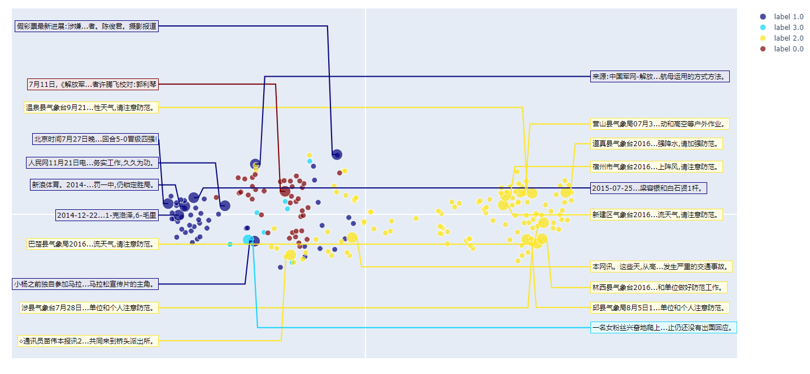

English | 快速上手 | Embedding应用 | 训练方法 | 训练数据 | 赞助 | 人员和贡献

# Luotuo Embedding 骆驼嵌入: Generative Text Embedding Model distilled from OpenAI API

骆驼嵌入是一个文本嵌入(text embedding)模型，由冷子昂, 刘思祎, 陈启源, 黄泓森, 陈舒年, 孙骜, 胡婧,李鲁鲁等开发

<details>
  <summary> 每个作者都是第一作者，顺序是随机的。(点这里具体)</summary>

李鲁鲁发起了项目，并完成了初步的验证，提出了KL散度Loss和Hard Negative挖掘。

刘思祎完成了初步训练框架的编写，以及支撑了后面模型上传到hugging face管线。

冷子昂完成了完整的大模型和小模型的训练，包括载入数据和损失函数的实现。

黄泓森负责爬取了OpenAI Embedding的数据。

陈启源协助修改了arxiv的论文。

陈舒年完成了重要的几个可视化。

孙骜（即将）用我们的得到的Embedding，完成CoT的提升实验。

胡婧（即将）完成更多的定量实验。

</details>

骆驼嵌入是[Luotuo(骆驼)](https://github.com/LC1332/Luotuo-Chinese-LLM)的子项目之一, 后者由李鲁鲁, 冷子昂, 陈启源发起。

<p align="center">
    
</p>

+ If you find this helpful, please star our major repo [Luotuo(骆驼)](https://github.com/LC1332/Luotuo-Chinese-LLM), Thanks Very Much

+ 如果你感到这个页面对你有帮助，拜托您去我们[骆驼的主页](https://github.com/LC1332/Luotuo-Chinese-LLM)也点上star，非常感谢！

## 快速上手


TODO:

+ 小模型连接可视化的evaluate代码（colab免费机器也能跑最好）

+ 大模型连接可视化的evaluate代码

+ 小模型的evaluate代码

+ 大模型的evaluate代码


|  | Colab链接 | 细节 |
| --- | --- | :--- |
| 小模型 | <a href="https://colab.research.google.com/github/LC1332/Luotuo-Chinese-LLM/blob/main/notebook/TuoLingC_evaluation_code.ipynb" target="_parent"></a> | BERT带可视化验证的notebook |
| 大模型 | <a href="https://colab.research.google.com/github/LC1332/Luotuo-Chinese-LLM/blob/main/notebook/TuoLingC_evaluation_code.ipynb" target="_parent"></a> | GLM-Encoder模型带可视化验证的notebook |
| 小模型Clean | <a href="https://colab.research.google.com/github/LC1332/Luotuo-Chinese-LLM/blob/main/notebook/TuoLingC_evaluation_code.ipynb" target="_parent"></a> | BERT最简代码的notebook |
| 大模型 | <a href="https://colab.research.google.com/github/LC1332/Luotuo-Chinese-LLM/blob/main/notebook/TuoLingC_evaluation_code.ipynb" target="_parent"></a> | GLM-Encoder模型最简代码的notebook |


## Embedding应用

+ TODO: 周一周二写新闻前，要完成其中至少三个，前两个是必须。可以选择学习少林七十二绝技，必修两门，选修一门。

- [文本数据可视化](#sec-visual) 任意文本分类数据的可视化

- [文本相关性测试](#sec-CSE) 周杰伦歌词之间的相关性测试。

- [文本的模糊搜索](#sec-IR) 周鸿祎为什么喜欢穿红衣？

- [文本聚类](#sec-grouping) 找呀找呀找朋友

- [少样本的分类学习](#sec-classificationg) 用embedding解决审核任务


<a name="sec-visual"></a>

### 文本数据可视化

+ TODO: 完成可视化，在这里使用新闻数据

对于任意多类的数据，围绕我们发布的Embedding模型，我们准备了一个特殊的可视化代码，可以将类别展示在二维平面，并抽样展示部分文本的内容。你可以直接在 大模型链接 / 小模型链接 中 运行体验。

<p align="center">
    
</p>

<a name="sec-CSE"></a>

### 文本相关性测试

+ TODO: 完成可视化，在这里使用课文+周杰伦的数据

在OpenAI的论文(补充论文)中，使用了大量文本（补充数量）来进行自监督学习。其关键假设是，在切开的文本中，连续的两段长文本是相关的。

<p align="center">
    
</p>

在这个测试中，我们使用一些训练数据(新闻数据)完全不覆盖的语料数据(中学语文课文和流行音乐歌词)，来进行测试。我们使用了如下的数据

4篇语文课文和一篇网文中的段落:《从百草园到三味书屋》, 《背影》,《出师表（现代文版）》,《雷雨》和《凡人修仙传》

5首周杰伦的架空世界观歌曲:《印第安老斑鸠》《三年二班》《双截棍》《威廉古堡》《米兰的小铁匠》

5首周杰伦的失恋情歌:《反方向的钟》 《搁浅》《完美主义》《黑色幽默》《对不起》

5首周杰伦的家庭类歌曲:《爸 我回来了》《上海 一九四三》《爷爷泡的茶》《外婆》《听妈妈的话》

为了进一步增加难度，我们在抽取的时候尽量避免前后的文本中，出现重复的关键字，如《印第安老斑鸠》的歌词如下

```
前半句:沙漠之中怎么会有泥鳅 话说完飞过一只海鸥 大峡谷的风呼啸而过 是谁说没有 有一条热昏头的响尾蛇 无力的躺在干枯的河 在等待雨季来临变沼泽 灰狼啃食着水鹿的骨头 秃鹰盘旋死盯着腐肉 草原上两只敌对野牛 在远方决斗

后半句:在一处被废弃的白蚁丘 站着一只饿昏的老斑鸠 印地安老斑鸠腿短毛不多 几天都没有喝水也能活 脑袋瓜有一点秀逗 猎物死了它比谁都难过 印地安斑鸠 会学人开口 仙人掌怕羞 蜥蝪横着走 这里什么奇怪的事都有 包括像猫的狗
```

我们通过这20对语料来向读者展示Embedding的特点。


+ TODO: 收集语料

+ TODO: 收集语料在大、小模型上的embedding

+ TODO: 补充结论段

<a name="sec-IR"></a>

### 模糊问题搜索

+ TODO

<a name="sec-grouping"></a>

### 文本聚类

+ TODO

<a name="sec-classification"></a>

### 少样本的分类学习

+ TODO

---


## Report

See our in writing report [here](./report.md)


## A Quick Start

+ Evaluation Code

+ Training Code

## Trained Models


## Contributors

The author order is in random, we detailly record the contribution here.

李鲁鲁 proposed the project, and do the starting effort on the preliminary experiment of embedding and designed the test and visualization.

陈启源 and HS implemented the data collecting server and collect all data.

冷子昂 and 641 developed the training framework and trained the GLM based Embedding model.

蒟蒻 developed an individual training framework and trained BERT based Embedding model.

## TODO

Embedding的测试需求

+ query-Answer

- 必须包括 周鸿祎 在360 ChatGPT展示大会的语料内容（ 这部分我可以让我老婆去看一下那个大会）

- 然后就是正常的新闻语料，找个10000个的base就可以

- 例子尽量使用周鸿祎展示的例子

- 额外再给一个别的例子就可以

+ 用户自由输入，进行文档retrieve

这里可以录一个视频

+ t-SNE展示1

这里鲁叔有个特别的t-SNE设计


考虑一个N类的t-SNE。我至多左右展示2M句话

每一句话都有一个展示位置。比如左侧就是 (图像左边界，(i-M/2) * offset)

所以有2M个展示位置

每个类c有一个颜色 (r_c,g_c,b_c)

从数据中，sample 2M个样本点，

然后这2M个样本点关于t_SNE的位置，和2M个展示位置做匹配

样本展示的颜色 = 类颜色 + 30级别的RGB扰动

连线考虑使用横线+斜线，如果算不出来就一根线直接连过去


+ Correspondence展示

<p align="center">
    
</p>

首先，最右侧是热图，热图务必用Jet的色表，务必显示右侧的colorbar

我建议输入格式支持setence pair（分好的） 和combined sentence

如果是combined setence，我有一个strong divide函数可以切开（记得问我要一下）

然后计算vecs（也可以预先载入，如果预先有就不重新计算了）

然后有一个visual_id，选择哪些对角线展示，如果visual_id为空，则均匀抽样

分别显示行和列的文字，并向对角线的元素连线，颜色使用对角线上那个元素的颜色

就是这样

+ 聚类+词云展示

我的colab里面已经有基本的例子

把我的词云加上stop words过滤


+ t-SNE with more data

base语料里面，找3个高频词。

相关的文章形成3个类，展示特征的t-SNE


+ 下游分类任务展示

展示10句A类语料，10句B类语料

然后给定新的句子，判断A类还是B类

+ openAI原假设验证

query和base画对角线热图 


