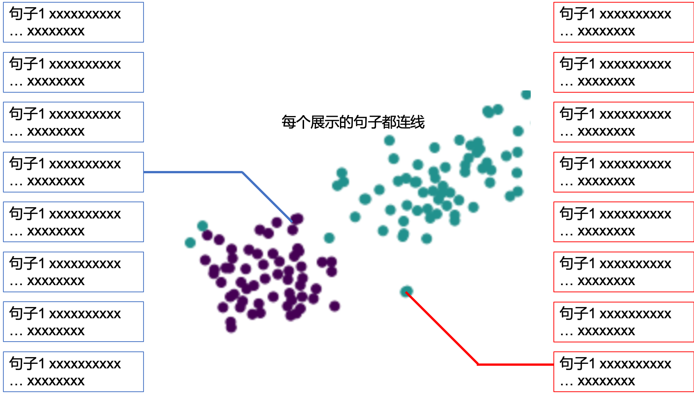

# Luotuo Embedding(骆驼嵌入): Generative Text Embedding Model distilled from OpenAI API

Luotuo Embedding(骆驼嵌入) is a text embedding model, which developed by 李鲁鲁, 冷子昂, 陈启源, 蒟蒻, HS, 641, 年等.

Luotuo Embedding belongs to the project [Luotuo(骆驼)](https://github.com/LC1332/Luotuo-Chinese-LLM), which created by 李鲁鲁, 冷子昂, 陈启源

+ If you find this helpful, please star our major repo [Luotuo(骆驼)](https://github.com/LC1332/Luotuo-Chinese-LLM), Thanks Very Much

+ 如果你感到这个页面对你有帮助，拜托您去我们[骆驼的主页](https://github.com/LC1332/Luotuo-Chinese-LLM)也点上star，非常感谢！

## A Quick Start

+ Evaluation Code

+ Training Code

## Trained Models

## Contributors

The author order is in random, we detailly record the contribution here.

李鲁鲁 proposed the project, and do the starting effort on the preliminary experiment of embedding and designed the test and visualization.

陈启源 and HS implemented the data collecting server and collect all data.

冷子昂 and 641 developed the training framework and trained the GLM based Embedding model.

蒟蒻 developed an individual training framework and trained BERT based Embedding model.

## TODO

Embedding的测试需求

+ query-Answer

- 必须包括 周鸿祎 在360 ChatGPT展示大会的语料内容（ 这部分我可以让我老婆去看一下那个大会）

- 然后就是正常的新闻语料，找个10000个的base就可以

- 例子尽量使用周鸿祎展示的例子

- 额外再给一个别的例子就可以

+ 用户自由输入，进行文档retrieve

这里可以录一个视频

+ 聚类+词云展示

我的colab里面已经有基本的例子

把我的词云加上stop words过滤

+ t-SNE展示

这里鲁叔有个特别的t-SNE设计

    

考虑一个N类的t-SNE。我至多左右展示2M句话

每一句话都有一个展示位置。比如左侧就是 (图像左边界，(i-M/2) * offset)

所以有2M个展示位置

每个类c有一个颜色 (r_c,g_c,b_c)

从数据中，sample 2M个样本点，

然后这2M个样本点关于t_SNE的位置，和2M个展示位置做匹配

样本展示的颜色 = 类颜色 + 30级别的RGB扰动

连线考虑使用横线+斜线，如果算不出来就一根线直接连过去

+ t-SNE with more data

base语料里面，找3个高频词。

相关的文章形成3个类，展示特征的t-SNE

+ 下游分类任务展示

展示10句A类语料，10句B类语料

然后给定新的句子，判断A类还是B类

+ openAI原假设验证

query和base画对角线热图 

