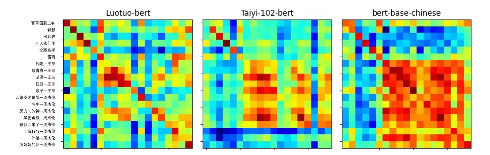
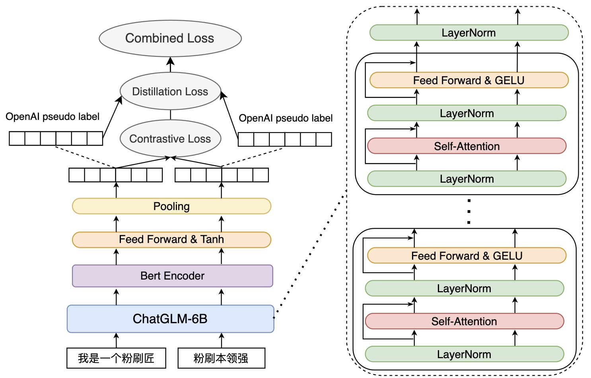
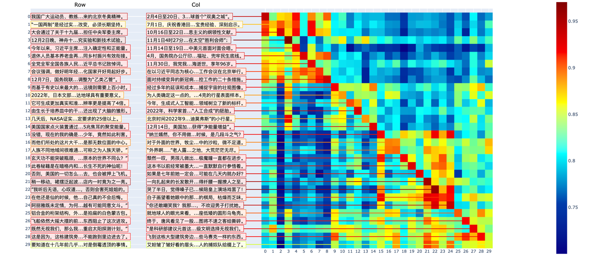

# Luotuo Embedding: Generative Text Embedding Model distilled from OpenAI API


<!-- polish the paragraph in ACL, ICML, Science's language style: -->

## Abstract

Recent advances in language modeling have enabled Sentence Embedding models to play an indispensable role in knowledge base construction, question answering, and multimodal tasks. In this technical report, we document our efforts beginning in April 2023 to distill sentence embeddings using 234k Chinese texts and xxx k English texts. Leveraging the text-embedding-ada-002 API by OpenAI, we have released luotuo-bert (110M parameters), luotuo-bert-medium (xxxM parameters), and luotuo-bert-en (xxxM parameters). The embedding spaces of these models are aligned with the OpenAI's model, enabling cross-lingual utilization in different downstream tasks. As an open research effort, we aim to train performant sentence embeddings with minimal data and compute. All code and data will be open-sourced on https://github.com/LC1332/Luotuo-Text-Embedding .

# Introduction

The proliferation of large language models has unlocked their utility across diverse tasks, from automated data analysis [AutoGPT] to reasoning [Wizard] and beyond [HELM]. This explosion of language model capabilities is bounded by the input length restrictions of Transformer architectures [cite], originally 4096 tokens in ChatGPT [cite]. Although improvements to attention mechanisms expand this horizon [cite], performance still demonstrably suffers on longer contexts [cite]. Consequently, developers must design applications mindful of length limits.

The mainstream approach chunks corpora into digestible contexts. At inference, a fixed number of chunks prime the LLM per query. This memorization empowers domain expertise, from question answering [cite] to conversational agents [ChatHaruhi]. Therefore, a universal sentence embedding is crucial for language models.

Recent advancements in pre-trained language models have enabled high-quality sentence embeddings for downstream natural language processing tasks. However, most publicly available Chinese sentence embedding models lag behind proprietary solutions like OpenAI's text-embedding-ada-002. To address this gap, we introduce Luotuo-Bert, an open-source project aiming to develop performant Chinese sentence embeddings with modest computational resources. 

In this paper, we report training details and quantitative/qualitative analyses for three models: Luotuo-Bert (110M parameters), Luotuo-Bert-Medium (xxxM parameters), and Luotuo-Bert-English (xxxM parameters). Our code, training data, and experiments are open-sourced to promote community adoption.

The main contributions are:

- We release performant open-source text embeddings to empower more natural language understanding tasks. At publication, models comprise a small Chinese embedder, a medium-sized model, and English embeddings.

- We propose distillation with self-training to simultaneously learn embeddings from a larger language model. 

- While models released after April 2023 surpass Luotuo-Bert using more data (e.g. M3E, BGE), our embeddings align representations across languages, unlike monolingual solutions. This multilingual alignment enables applications spanning diverse languages.

## Related Works


## Approach

In this section, we first introduce our novel loss function design, followed by details on training.  

## Loss Function

Prior work by OpenAI [citation] trained on massive amounts of text data. To obtain strong performance given constrained computational resources, we aim to distill OpenAI's text-embedding-ada-002 model.

Mathematically, given text segments $T_1$ and $T_2$, we desire a function $f()$ such that if $T_1$ and $T_2$ are contextually related, $f(T_1)$ and $f(T_2)$ have high cosine similarity. Conversely, if $T_1$ and $T_2$ are from different texts, $f(T_1)$ and $f(T_2)$ should have near-zero cosine similarity.


| L1 | L2 | L3 |
|---|---|---|
| Distill Loss | KL Loss | margin loss |

Since OpenAI provides powerful feature representations where related texts $T_1$ and $T_2$ yield embedded features $g(T_1)$ and $g(T_2)$ that are close in feature space, we also optimize $f(T_1)$, $f(T_2)$ to align with $g(T_1)$, $g(T_2)$. This co-distillation offers three potential benefits: 1) Distilling from OpenAI's strongly supervised features may accelerate and stabilize $f$'s training from limited text data. 2) Leveraging OpenAI's extra supervision acts as a strong topic model, improving generalization. 3) Aligning with OpenAI embeddings facilitates integration into applications already using their API. We use OpenAI's text-embedding-ada-002 interface as $g$, which maps variable-length text to $d=1536$-dim features.

To achieve these goals, our loss comprises three terms: distillation loss, KL divergence loss, and margin loss. 

### Distillation Loss

Given a batch of text pairs $\{(T_1, U_1), ..., (T_N, U_N)\}$ where $(T_n, U_n)$ comes from splitting text around a midpoint, we obtain target distillation features $(g(T_n), g(U_n))$ from OpenAI's API. 

The distillation loss simply minimizes the distance between $f$'s and $g$'s embeddings:

$L = \mathbb{E}_n[|f(T_n) - g(T_n)|_p] + \mathbb{E}_n[|f(U_n) - g(U_n)|_p]$

We initially experimented with MSE loss ($p=2$) and found $l_1$ loss to perform better, though we did not have time for ablations.


### KL Divergence Loss

Applying $f$ and $g$ on the batch $\{T_n\}$ yields matrices $f(\{T_n\})$ and $g(\{T_n\})$ of size $n \times d$. Similarly for $\{U_n\}$, giving $f(\{U_n\})$ and $g(\{U_n\})$. 

We compute cosine similarities between every pair of embedded segments. Specifically, we L2 normalize the rows of $f(\{T_n\})$ and $f(\{U_n\})$ and multiply to obtain similarity matrix $R$:

$R = \text{normalize}(f(\{T_n\})) \cdot \text{normalize}(f(\{U_n\}))^T$

Likewise for $g$, giving similarity matrix $S$: 

$S = \text{normalize}(g(\{T_n\})) \cdot \text{normalize}(g(\{U_n\}))^T$

Fig. 1 visualizes $R$ and $S$. 

Standard self-supervised learning like CLIP [cite] applies cross-entropy loss to $R$'s rows and columns, treating the diagonal as ground truth. However, this has some drawbacks: 1) It does not utilize $S$ from the pretrained OpenAI encoder. 2) Some $T_n$, $U_n$ pairs may not be strongly related. 3) Previous work shows benefits from relating $T_i$, $U_j$ across pairs.

To address these issues, we propose a KL divergence loss between softmax normalized $R$ and $S$: 

$P = \text{softmax}(R, \text{axis=0})$

$Q = \text{softmax}(S, \text{axis=0})$

$L_{KL0} = \mathbb{E}_n[KL(p_n || q_n)]$

$P = \text{softmax}(R, \text{axis=1})$ 

$Q = \text{softmax}(S, \text{axis=1})$

$L_{KL1} = \mathbb{E}_n[KL(p_n || q_n)]$

$L_{KL} = L_{KL0} + L_{KL1}$

Advantages of this loss include: 1) fully utilizing OpenAI's similarity probabilities as soft targets, 2) supporting relating segments across pairs, and 3) compatibility with hard negative mining. 

We can strengthen the pairing prior by fusing $Q$ into the posterior via Bayesian estimation:

$\tilde{Q} = \sqrt{1/((1-\lambda)Q^2 + \lambda I)}$

where $I$ is the identity matrix and $\lambda \approx 0.3$.

## Implementation Detail


### Network Architecture

Our work employs two neural network architectures of varying sizes. Both architectures share the approach of encoding text sequences combined with positional encodings as input to a BERT encoder, outputting 1536-dimensional feature vectors. However, cognizant of diverse GPU memory capacities, we offer two backbone models of different scales: one ~300M parameter BERT and one ~100M parameter BERT. The English BERT backbone contains ~888M parameters.

### BERT as Backbone

Since its release, BERT has been widely adopted in NLP, with many inference architectures like Hugging Face enabling easy BERT integration across applications. Thus, our small and medium models use BERT as the backbone for embedding text. For any input text, BERT first tokenizes via BertTokenizer into input_ids, then maps these to embeddings, passes them through the encoder to obtain representations, and finally uses the [CLS] token's last encoder layer hidden state as the text embedding. We leverage IdeaLab's released small and medium pretrained models [Feng Shen Bang paper] as initialization. 

### Initializing with ChatGPT-6B Embeddings 

In conversational systems utilizing large language models like ChatGPT, we observe that content moderation happens after users submit questions or agents generate responses. Presumably, these systems follow [OpenAI embedding paper]'s approach of extracting top LM hidden states as input to the encoder for embedding, which has advantages: 1) In production, reusing computed LM hidden states saves computation. 2) Large pretrained LMs encode strong generalization. However, given the release of many large embedding models since April 2023, we ultimately did not train with this approach.


### Epochs and loss

We found that solely optimizing the $l_1$ distillation and self-correlation losses led to the correlation matrix $R$ becoming nearly all 1s after only 1 epoch of training. As described previously, introducing a scaling factor $\beta$ could postpone this phenomenon but not eliminate it. Adding a margin loss alleviated this issue but decreased performance. Through experimentation, we determined a more robust approach of first training for 1 epoch with just the $l_1$ distillation loss to align $f$'s and $g$'s output distributions before incorporating the self-learning loss for 2-4 more epochs. This yielded a relatively stable model $f$ without needing the margin loss. All three of our released models use this training procedure, requiring ~XXX hours on a 4-A100 machine for 234k*2 examples over 3 epochs. 

### Hard Negative Mining

Per prior work shows contrastive losses like CLIP can lead to models learning an overly simple task. We considered incorporating hard negative mining into future models, where for each epoch, we first sample an unused example and retrieve its n most semantically similar instances for training. This increases the difficulty throughout training. For each batch, we could randomly sample a sentence and find not-yet-seen sentences with the most similar embeddings to form a batch, ensuring challenging negatives are present. However, we found this search inefficient to implement and did not utilize this strategy.


### BERT as Backbone

Since its release, BERT has been widely adopted in NLP, with many inference architectures like Hugging Face enabling easy BERT integration across applications. Thus, our small and medium models use BERT as the backbone for embedding text. For any input text, BERT first tokenizes via BertTokenizer into input_ids, then maps these to embeddings, passes them through the encoder to obtain representations, and finally uses the [CLS] token's last encoder layer hidden state as the text embedding. We leverage IdeaLab's released small and medium pretrained models [Feng Shen Bang paper] as initialization. 

### Initializing with ChatGPT-6B Embeddings 

In conversational systems utilizing large language models like ChatGPT, we observe that content moderation happens after users submit questions or agents generate responses. Presumably, these systems follow [OpenAI embedding paper]'s approach of extracting top LM hidden states as input to the encoder for embedding, which has advantages: 1) In production, reusing computed LM hidden states saves computation. 2) Large pretrained LMs encode strong generalization. However, given the release of many large embedding models since April 2023, we ultimately did not train with this approach.


## Experiments

We evaluate our proposed method, luotuo-BERT, on two out-of-domain tests to verify its ability to extract text relevance without using the training data. In fact, after completing these two qualitative experiments, we have applied luotuo-BERT to a series of follow-up subprojects under the luotuo project. The subsequent experiments will present the evaluations of luotuo-BERT by M3E and BGE released in the summer of 2023. These experiments validate that our proposed luotuo-BERT is competitive with OpenAI on many tasks. In the final part, we provide a cross-lingual QA experiment.  

### Qualitative Experiments - Relevance Test

In the OpenAI paper [add citation], a large amount of text (add quantity) is used for self-supervised learning. The key assumption is that contiguous segments of long text are related when split. In this application, we verify this assumption on two tests. Since our current model version is trained on news data, we want to find two batches of text from different domains to validate the model's capability.

+ Web text news data: We take 15 web texts and add 15 news outside of the dataset. We look for long paragraphs in the texts and split them into previous and next segments. To increase the difficulty, we avoid excessive overlapping words when splitting the web text data.

+ Jay Chou challenge: Since there are some repetitive words in previous and next segments of news data, and the coherence of web texts is quite strong. We want to make a harder challenge. We take 3 middle school textbooks, 2 web texts, 5 Faye Wong's songs, and 8 Jay Chou's songs with different content. In this challenge, we manually remove repetitive short phrases (e.g. choruses) and avoid repetitive words across splitted segments. 

Below are the splitted previous and next lyrics from "Indian Old Ground Dove", a narrative acid jazz song from Jay Chou's first album:

```
First half: How could there be loaches in the desert A seagull flew by saying Wind howling in the Grand Canyon Who said there isn't A hot-headed rattlesnake Lying powerless in the dried-up river Waiting for the rainy season to turn into a marsh Gray wolves gnawing on deer bones Vultures hovering staring at rotten meat Two bison on the grassland Dueling in the distance  

Second half: On an abandoned termite mound Stands a hungry old ground dove Indian old ground dove Short fur and short legs Can live for days without water A bit of a silly head Saddest when its prey dies Indian old ground dove Can talk like humans Cactus shy Walking lizards Here everything strange happens Including cat-like dogs
```

Here is the paragraph polished in ACL/ICML/Science style:

#### Web Text News Test

We tested Luotuo-BERT on 30 pairs of web text news data. We additionally implemented a visualization that not only shows the heatmap but also samples text information involved in the heatmap. We can see that:

1. The assumption in the OpenAI paper is largely verified. Namely, the previous and next segments of a text exhibit strong relevance. 

2. Since our model is trained on news, it currently performs better on news.

3. For texts from different domains, the relevance matrix shows a block-diagonal form. Even between different types of news and web texts, this characteristic exists.

3. According to our test, the current model can also reflect good relevance on texts from other domains. Further supplementing training texts from other domains can improve the model's adaptability to different domains.


#### Jay Chou Challenge

In the Jay Chou challenge, we compared the results of our baseline model before training, IDEA's Tai-102M BERT, and our trained Luotuo-BERT. We also present the results of Hugging Face's default BERT-base-Chinese. (Results of larger BERTs will be released on Monday)

See the tSNE visualization for the Jay Chou challenge.


Observing the figure below, we can draw several conclusions:

1. Compared to the web text news test, the lyrics test is much more difficult. Even for humans to observe the previous and next texts, it is hard to discern obvious relevance. 

2. For songs by the same singer or similar themes, we can see block-wise correlations. 

3. We also compared with OpenAI's results. Through distillation learning, our LuotuoBERT has achieved competitive results with OpenAI's API. Hence, we consider further strengthening the diagonal prior in the KL divergence loss, instead of simply taking OpenAI's structure as the target probability.

### Qualitative Experiments - Visualization and Clustering

For any multi-class data, we have prepared a t-SNE visualization code around our released embedding model, which can display categories on a 2D plane and sample partial text content. You can directly run and experience it in the large model link / small model link. 

<p align="center">
   
</p>

From the visualization we can see that the basic assumption in OpenAI's original paper is largely verified. Even for impromptu lyrics, after cutting them in the middle and removing repetitive text, the previous and next segments of lyrics can still exhibit strong relevance. The previous and next segments of songs remain close in the feature space.


### Quantitative Experiments 

After releasing our model, the m3e report selected 6 text classification datasets. Similar to MTEB, the accuracy of different models was reported. In the BGE report, more tasks were tested. We can see that our embedding achieves comparable performance to OpenAI's text-embedding-ada-002 on various tasks. Considering the report in [neelakantan2022text] that OpenAI's embedding uses a batch size up to 12k and trains over 30,000 steps, we only used a 128 batch size (32 per A100) and trained for less than 2,000 steps on 200k scale data. The computational resources required by our approach are much less than OpenAI's.

### Cross-Lingual Search

Notably, since OpenAI's text-embedding-ada-002 supports many languages, we can align embeddings cross languages. 

Here we demonstrate a cross-lingual QA example. After building the database in Chinese/English, we query in the other language to see if we can search and answer the question correctly. We qualitatively compared several cross-lingual embedding models between Chinese and English.


@article{neelakantan2022text,
  title={Text and code embeddings by contrastive pre-training},
  author={Neelakantan, Arvind and Xu, Tao and Puri, Raul and Radford, Alec and Han, Jesse Michael and Tworek, Jerry and Yuan, Qiming and Tezak, Nikolas and Kim, Jong Wook and Hallacy, Chris and others},
  journal={arXiv preprint arXiv:2201.10005},
  year={2022}
}


# Luotuo Embedding: Generative Text Embedding Model distilled from OpenAI API

冷子昂 *, 陈舒年 *,   胡婧 *,  Liu Siyi *, 陈启源 *,   HS *, 641 *, 李鲁鲁 *

#### 作者的footnote


作者的顺序是完全随机的，每个人的具体贡献如下:

冷子昂训练了luotuo-bert 110M模型，并搭建了训练框架

陈舒年训练了luotuo-bert-en模型，以及项目中大部分的可视化

胡婧训练了luotuo-bert-medium模型

Liu Siyi 参与实现了训练的代码。

陈启源和HS建立了数据收集的架构，并完成了数据的收集

李鲁鲁提议了整个项目，并完成了初始的实验验证，以及编写了最终的技术报告。


## 摘要

随着语言模型的发展，Sentence Embedding模型在记忆库构造，文本问答以及多模态任务中起着至关重要的作用。本技术报告记录了我们在2023年4月开始的一系列尝试。我们组织了234k的中文数据，以及xxxk的英文数据。使用这些数据，结合openai开放的text-embedding-ada-002接口进行了蒸馏。并最终发布了luotuo-bert(110M), luotuo-bert-medium(xxxM)和luotuo-bert-en(xxxM)三个模型。这些模型，以及openai的在线接口的分布之间是相互对齐的，这样在不同的任务中，这些embedding模型可以独立使用，也可以跨语言进行使用。作为一个开源研究，我们尝试用尽可能少的数据和计算资源来对setence embedding进行训练。所有的代码和数据将陆续在 https://github.com/LC1332/Luotuo-Text-Embedding 中开源。


## Introduction

随着大型语言模型的发展，人们逐渐发现了语言模型可以在更多的任务中得到使用[引用HELM]，甚至是自动辅助数据分析[autoGPT], 解决更复杂的逻辑问题[wizard]等。语言模型的相关工作，得到了爆发式的发展。然而，受到Transformer[cite]或者类似Transformer模型，总是会受到窗口长度的限制。经典的ChatGPT的窗口长度被设计为4096个token。即使通过改变attention的机制[引用]，研究者可以进一步扩展语言模型的限制。然而，受到训练数据组织的限制，模型在较长输入时，仍然会出现明显的性能下降[引用]。由此，在构筑应用的时候，开发者仍然需要考虑到模型的输入长度限制。

一般主流的做法，是将数据库的语料切割为chunk。然后在特定应用调用LLM的时候，给出一定数量的chunks作为context。这样往往可以提升语言模型系统对于专业领域知识的记忆能力。最常见的应用是在特定的知识问答[引用]，在一些角色扮演的chatbot中，也可以看到这样的使用[引用ChatHaruhi]。由此，对于语言模型来说，一个好的通用sentence embedding尤为重要。

<p align="center">
    
</p>


+ embed_compare_fig1 , 根据 [OpenAIembedding论文] 的假设，在文本中间切开，前半部分和后半部分的文本embedding应该出现较强的相关性。在这个初步的实验中，我们调用了 [字节的数据集] 中的100条数据，并且将其从最接近中间的句号切开，分别在三个模型上测试了前半部分文档和后半部分文档的Embedding的余弦相似度。 可以发现，在OpenAI的API接口中，文本的相关性得到了有效的体现，即使前文和后文没有太多的重复词汇，也能够在对角线上体现很高的相关性。而BERT，由于采用的是文本dropout训练的方式，对于文本前后文的关联，刻画没有那么好的描写。而我们的模型实现了接近OpenAI API的效果。 这个图要补成2*2的 增加我们的结果

在2023年4月初，可用的中文Sentence Embedding模型较少。大多数开源模型与openAI提供的text-embedding-ada-002的性能相比较弱。由此，我们启动了Luotuo-Bert这个开源项目，希望能够从现有的开源模型出发，探究能否用相对较少的计算资源，较少的数据的情况下，得到一个能够在各个场景满足使用的中文Sentence Embedding模型。这篇文章，报告了我们luotuo-bert(110M), luotuo-bert-medium(xxxM)和luotuo-bert-en(xxxM)三个模型的训练过程和对应的一些定量/定性实验结果。所有的代码包括测试代码、训练代码以及所有训练数据都会逐步清理和开源，供社区使用。

本文的主要贡献是

+ 本文实现了一个通用的Text Embedding开源模型，可以有效支持更多的下游自然语言理解的任务。截止这篇arxiv文档的发布，Luotuo-Bert一共发布了小模型(110M)、中等大小的中文embedding模型和一个支持英文的setence embedding模型。

+ 本文提出了一套蒸馏的同时进行自学习的方案，可以同步从一个较大的语言模型中，学习text的embedding。

+ 我们注意到在2023年4月之后，已经有使用更多训练数据得到的embedding模型，比如M3E和BGE。
本文提供的embedding模型，可以在不同语言下与openai的embedding接口实现对齐。对于一个单语言，或者是仅涉及中文和英文的应用，确实使用这些性能更好的embedding模型会获得更好的效果。但是如果一个应用涉及更多种类的语言，将不同的语言都对齐到一个共同的分布是一个显然需要探究的问题。

## Related Works

作为一个self-contain的报告，我们在这里描述一下Text Embedding的基本目标和相关的工作。


+ Text Embedding的训练目标

这里chenqy补充一下？从基础n-gram的embedding，讲到bert，再讲到GPT3那个？

然后讲一下有监督和自学习的loss，我们这里主要是启用了自学习的loss。

图\ref{embed_compare_fig1}中可以看到，我们使用 [字节那个数据集] 中的一部分数据，验证了[openAI那个paper] 的假设。在OpenAI实际给出的API中，前半段的文本和后半段的文本有很强的相关性。因此在本文中，我们主要考虑与 [字节那个数据集] 相同的自监督loss。


## 损失函数的构造

在本来[OpenAIembedding论文]的工作中，使用了[xxxs]规模的语料。而在我们的工作中，为了在更可支付的计算资源下得到模型，我们希望考虑在单卡A100的情况下，能够在7天级别内训练得到的模型。因此我们考虑了对OpenAI的[text-embedding-ada-002]模型的输出进行蒸馏。

从数学的角度来说，给定文本 $T_1$ , $T_2$ ，我们希望得到一个函数 $f()$ ，如果 $T_1$ 和 $T_2$ 在文本中是相互连接的上下文关系，我们希望 $f(T_1)$ 和 $f(T_2)$ 在consine相似度上尽可能接近;反之，如果 $T_1$ 和 $T_2$ 来自不同的文本，我们希望 $f(T_1)$ 和 $f(T_2)$ 的consine相似度尽可能接近0。


TODO: 这里补一个图，解释3个loss

| L1 | L2 | L3 |
|---|---|---|
| Distill Loss | KL Loss | margin loss |


由于OpenAI已经提供了强特征的接口，即存在一个OpenAI提供的函数 $g()$ ，已经能够让关联的文本 $g(T_1)$ 和 $g(T_2)$ 抽取得到的embedding特征，在特征空间上足够的近。所以我们考虑在使 $f(T_1)$ 和 $f(T_2)$ 尽可能接近的时候，也同时让 $f(T_1)$ , $f(T_2)$ 与 $g(T_1)$ ，$g(T_2)$ 分别对齐。这样做可能存在3个好处: 1. 因为OpenAI的特征已经有很强的监督信息，根据过往的模型蒸馏的报告，在一个较强的指导信息下，会使得 $f$ 函数的收敛更快，并且在更小的数据上能够熟练。 2. 因为我们只使用了有限的语料，使用OpenAI额外的监督，可以看成引入了一个很强的topic模型，有助于增加小模型的泛化能力。 3.与OpenAI的Embedding对齐，可以有助于我们的模型对接很多已经在使用OpenAI Embedding API的应用。 在这里我们使用OpenAI的text-embedding-ada-002接口作为g函数，对于任意长度输入的文本，这个接口返回 $d = 1536$ 维的特征。

对于上述的学习目标，我们设计了三个成分的损失函数，分别是蒸馏损失，KL散度损失和Margin损失。

### 蒸馏损失函数

在这里我们假设每次训练时考虑一个Batch的输入 $\{ (T_1, U_1), ... , (T_N, U_N) \}$ ，其中 $(T_n , U_n)$ 为一个文本对，我们每次从长度约为300-800的文本中，从接近中间的句号或者换行处切开，将前后的文本分别定义为 $T_n$ 和 $U_n$ 。根据 OpenAI论文 的假设，前后的文本应该有较强的相关性。对于每一对文本，我们都通过OpenAI的接口，获得了蒸馏目标的特征 $(g(T_n), g(U_n))$ 。

蒸馏损失函数的构造非常简单，

$L = E_n \[  | f(T_n) - g(T_n) |_p \] + E_n \[ | f(U_n) - g(U_n) |_p \] $

在这里我们初步的实验使用了p=2的MSE损失函数，之后替换为了 $p=1$ 的 $l_1$ 损失。根据我们初步的实验，我们发现$l_1$损失得到的性能会更好一些，但是我们没有时间做明确的消融实验去证实。


### KL散度损失

将整个Batch的 $\{ T_n \}$ ，都通过f函数或者g函数，会得到 $f(\{T_n\})$ 和g(\{T_n\})，这些都是n * d的矩阵。同样我们也会得到 f(\{U_n\})和g(\{U_n\})。

接下来我们需要对每一对数据，去求consine的相似度。这一步可以按照将f(\{T_n\}) 与 f(\{U_n\})每行都求l2归一化，然后再相乘得到。我们记这个结果为R

R = l2_normalize( f(\{T_n\}) ) *  l2_normalize( f(\{U_n\}) )^T

同样的，我们将g(\{T_n\})与g(\{U_n\})做相同的操作得到S

S = l2_normalize( g(\{T_n\}) ) *  l2_normalize( g(\{U_n\}) )^T

为了方便理解，图embed_compare_fig1 中的可视化就代表了不同模型的R矩阵，以及OpenAI接口得到的S矩阵。

在标准的自学习，如CLIP中，一般的方法会对R矩阵，按行和列，分别以对角线为ground truth，求cross entropy。这里我们直接引用CLIP论文中的伪代码:

```python
labels = np.arange(n)
loss_i = cross_entropy_loss(R, labels, axis=0)
loss_t = cross_entropy_loss(R, labels, axis=1)
loss = (loss_i + loss_t)/2
```

然而，这样直接的Cross Entropy会有一些缺点: 1. 这样的Cross Entropy损失函数，并没有使用已经训练良好的OpenAI的Embedding的S信息。 2. 在实际的数据中，有些切开的 $T_n$ 和 $U_n$ 不一定有很强的关联。 3. 有很多其他自学习的研究表示，有可能会出现 $T_i$ 和 $U_j$ 的关联很强，在自学习的时候最好能考虑到这些信息。

由此，我们修改了这个损失函数，将其改为KL散度损失，使其能够更好的利用上Q的信息，并且也能够在之后适配我们的Hard Negative Mining。对于R和S，我们希望通过按行和按列，取SoftMax，得到一个归一化的概率矩阵,P和Q。然后对他们按行/列，去计算KL散度。

```python
P = softmax(R, axis = 0)
Q = softmax(S, axis = 0)
KL(p_n* ||  q_n* ) = sum_i p_ni log(p_ni / q_ni )
L_KL0 = E_n \[ KL(p_n* ||  q_n* ) \]
P = softmax(R, axis = 1)
Q = softmax(S, axis = 1)
L_KL1 = E_n \[ KL(p_n* ||  q_n* ) \]
L_KL = L_KL0 + L_KL1
```

注意到这样的损失函数有几个优点: 1. KL损失能够充分利用已有的文本关联概率信息，以OpenAI接口产生的Pesudo Label信息概率作为目标。 2. KL散度能够支持多响应信息的训练。 3. 对于后续的Hard Negative Mining， KL散度损失函数有更好的适应性。

在后续的训练中，我们注意到在文本中，我们的Embedding已经和OpenAI的接口已经有匹敌的性能。我们也可以将 $Q$ 矩阵融入到贝叶斯估计中，加强 $U_n$ 和 $T_n$ 的匹配先验，即

$\tiled{Q} = \sqrt( 1 ./ ( (1-\lambda) * Q.^2 + \lambda * I ) )$

其中 $I$ 是 $n*n$ 的单位矩阵，$\lambda$ 是一个0.3左右的系数。

### Margin损失

在中等模型以上的模型时我们发现以一个现象，无论使用Cross Entropy Loss还是KL散度Loss，R矩阵会随着训练的轮次不断增大。这个现象在过往的CLIP等论文中并没有相关的报告。我们怀疑时由于Distill Loss和KL散度Loss发生了一定的相互作用，产生了过拟合。

对于Cross Entropy损失来说，如果在R矩阵上增加一个常数 $R' = R + c$ ，并不会改变Cross Entropy的数值。而对于KL散度loss，$R' = R +c$ 也不会产生很大的影响。我们怀疑前两个loss的相互作用使得R在不断增大。我们在一开始实验了 ArcFace2中的一个技巧，在 $R$ 上面乘以一个scale系数，即 $P = softmax( beta R )$ 来试图消除这个现象，但是并没有起到明显的效果。

由此，我们引入一个Masked Margin Loss，这个损失函数在过往的很多度量学习的工作中非常常见

$L_Margin = max(0, M .* R - margin )$

其中 $M = ones(n,n) - I$ ， 是一个除了对角线是0，其他元素都是1的矩阵。 margin是一个0.5左右的系数。


## 训练细节

### 网络架构

关于网络backbone的选取，我们的工作使用了2种不同规模的网络。他们相同之处在于，最终文本的信息都会以序列的形式，结合Positional Encoding，输入到一个BERT的Encoder中，并输出1536维的特征。但是考虑到不同机器的显存大小，我们提供了两种不同大小的底层模型，分别是以一个300M左右的BERT作为backbone和一个100M左右的BERT作为backbone。英文的Bert模型使用一个888 M的模型作为backbone。

<p align="center">
    
</p>


### loss细节

我们发现，如果单纯使用 $l_1$ 蒸馏损失加自相关损失进行直接训练。会出现1个epoch以后相关矩阵 $R$ 极度变大（几乎都变为1）的情况。根据之前的描述，引入一个scale乘数 $\beta$ 可以减缓这个现象发生的iter时间，但是不根本解决这个问题。引入Margin损失可以缓解这个现象，但是也会带来性能的下降。多次实验后，我们发现更可靠的方法，是先使用 $l_1$ 蒸馏loss去训练1个epoch，确保 $f$ 的输出分布已经能够和 $g$ 接近。这个时候再进一步引入自学习的loss训练2-4个epoch，就可以得到一个相对稳定的模型 $f$ 这个时候是否引入margin loss显得没有那么必要。 最终我们发布的3个模型都使用这样的流程去训练。我们在一台4卡A100的机器上对embedding模型训练，对234k*2数据，训练3个epoch的大约耗时为xxx小时。


### Hard Negative挖掘

根据过往的一些研究，类似CLIP这样的损失函数，会使得网络学习的任务过于简单。我们考虑在后续的模型中，加入Hard Negative Mining。对于每个Epoch的训练，我们首先选取一个当前没有被选过的样本，并且抽取n个与其语义最近的样本，进行训练。这样可以增加训练时候整个问题的难度。对于每个batch，可以随机选取一个句子，然后从这个epoch还没有出现的句子中，寻找当前embedding较为接近的样本一同组合组成一个batch。这样可以保证较难的负样本可以被放置在一个batch中。不过在实现后我们发现这样搜索的效率并不高。所以没有使用这个策略。


### BERT作为Backbone

自BERT发布之后，有大量的NLP工作验证了其有效性。并且有非常多的推理架构，如Hugging Face，使得BERT可以被更方便地在各种场景进行应用。所以在小模型和中模型中，我们使用BERT模型作为我们embedding model的backbone。任意一段文本被输入进BERT模型后，会先被BertTokenizer tokenize成input_ids，然后放入embedding层使它向量化，然后通过encoder学习他的表征，最后使用encoder最后一层的[CLS]的hidden states作为这段文本的表征。在这里我们利用了IDEA发布的小模型和中模型作为预训练的权重[封神榜的论文]。


### 利用ChatGLM-6b对embedding初始化

对于ChatGPT或者其他一些商业的使用最新语言模型的对话系统观察可以发现。在用户每次提交问题，或者Agent生成回答之后，系统才会进行内容审查。我们推测在这里，这些系统使用了和[OpenAIembedding论文]中一致的方法，即抽取大型语言模型的顶层hidden state，作为Encoder的输入来进行Embedding。显然这样做有几个好处: 1. 在一个工业化的架构中，利用大语言模型已经计算得到的隐层信息，可以节省很多运算 2. 大型语言模型已经在非常的语料上进行训练，可以有效增强模型的泛化能力。不过介于在2023年4月之后，已经有很多的大型的embedding模型，我们最终没有对着合格方案进行训练。


## 实验

实验的介绍分为下面几个部分。首先我们会先给出两个out-domain的测试，验证在使用训练集之外的数据的情况下，luotuo-bert是否能够有效抽取出文本之间的相关性。事实上在这两个定性实验完成后，我们就陆续将luotuo-bert用在luotuo项目的一系列后续子项目中。之后的实验环节，将会介绍2023年夏天发布的M3E和BGE对luotuo-bert的测评。这些实验验证了我们提出的luotuo-bert和OpenAI在很多任务上是comeptitive的。在最后一个环节，我们会给出一个跨语言的QA实验。

### 定性实验-相关性测试

在OpenAI的论文[补充引用]中，使用了大量文本（补充数量）来进行自监督学习。其关键假设是，在切开的文本中，连续的两段长文本是相关的。在这个应用中，我们会在两个测试上验证这个假设。因为我们目前版本的模型的训练数据都是新闻，我们想找两批不同领域的语料，来验证模型的能力。

+ 网文新闻数据: 我们选取了15篇网文，并且加上了15篇数据集中不覆盖的新闻数据。并且寻找语料中的大段落，进行前后的切分。在网文数据中，为了增加挑战性，我们避免切分前后的数据出现过多重复的词汇。

+ 周杰伦挑战: 由于新闻数据前后文中会有一定数量重复的词汇，而网文叙述的连贯性也很强。所以我们想做一个更难的挑战，我们选取了3篇中学课文，2篇网文，5首王菲的歌，以及8首不同内容的周杰伦的歌。并且在这个挑战中，切分后的前文和后文中，我们人工去除了重复的短句（如副歌），并避免重复的词汇。

下面是周杰伦的第一张专辑中，一首Acid爵士风格的叙事歌曲《印第安老斑鸠》在切分后的前后歌词

```
前半句:沙漠之中怎么会有泥鳅 话说完飞过一只海鸥 大峡谷的风呼啸而过 是谁说没有 有一条热昏头的响尾蛇 无力的躺在干枯的河 在等待雨季来临变沼泽 灰狼啃食着水鹿的骨头 秃鹰盘旋死盯着腐肉 草原上两只敌对野牛 在远方决斗

后半句:在一处被废弃的白蚁丘 站着一只饿昏的老斑鸠 印地安老斑鸠腿短毛不多 几天都没有喝水也能活 脑袋瓜有一点秀逗 猎物死了它比谁都难过 印地安斑鸠 会学人开口 仙人掌怕羞 蜥蝪横着走 这里什么奇怪的事都有 包括像猫的狗
```

<p align="center">
    
</p>


#### 网文新闻测试

我们对Luotuo-BERT在网文新闻30对的数据上进行了测试。我们额外编写了一个可视化，除了热图的展示，我们还抽样展示了热图中涉及数据的文本信息。可以看到

1. OpenAI论文的假设被基本验证。即一个文本的前段和后段呈现很强的相关性

2. 由于我们的模型是在新闻上训练的，当前在新闻的表现上更好。

3. 对于不同domain的文本，相关性矩阵会呈现分块对角的形式，甚至在不同类型的新闻，不同类型的网文之间，也有这样的特点。

3. 根据我们的测试，当前的模型在其他domain的文本上，也能体现出良好的相关性。如果进一步补充其他领域的训练文本，可以使得这个特征有更好的不同领域的适应能力。


#### 周杰伦挑战

在周杰伦挑战中，我们对比了我们训练之前的基础模型，IDEA团队的Tai-102M的BERT，以及我们训练后的Luotuo-BERT的结果，同时我们还展示了Hugging Face默认的BERT-base-Chinese模型的结果。（更大BERT的结果将在周一放出）

周杰伦挑战的图见tSNE可视化。

<p align="center">
    
</p>

polish the paragraph in ACL, ICML, Science's language style:

观察下图我们可以得出几个结论

1. 相比于网文新闻测试，歌词测试要难得多。即使是人类来观察前后文本，也很难看出明显的相关性。

2. 有一些同歌手、相近主题的歌曲，会出现分块相关的情况。

3. 我们也对比了OpenAI的结果，通过蒸馏学习，我们的LuotuoBERT已经能够达到和OpenAI的API competitive的结果，所以我们后续考虑在KL散度Loss中，进一步加强对角先验，而不是单纯只考虑OpenAI的结构为目标概率。

### 定性实验-可视化和聚类

对于任意多类的数据，围绕我们发布的Embedding模型，我们准备了一个t-SNE的可视化代码，可以将类别展示在二维平面，并抽样展示部分文本的内容。你可以直接在 大模型链接 / 小模型链接 中 运行体验。

<p align="center">
    
</p>

通过可视化看我们可以看到，OpenAI原论文的基本假设基本得到验证，即使是很写意的歌词，在中间切开，去除重复文本之后。前段歌词和后段歌词仍然能够呈现很强的相关性。歌曲的前后段在特征空间中都很接近。

polish the paragraph in ACL, ICML, Science's language style:

### 定量实验

在我们的模型发布后，在m3e的报告中，

| 模型 | text2vec | m3e-small | m3e-base | openai | DMetaSoul | uer | erlangshen | luotuo-bert-medium |
|---|---|---|---|---|---|---|---| 
| TNews | 0.43 | 0.4443 | 0.4827 | 0.4594 | 0.3084 | 0.3539 | 0.4361 | 0.4547 |
| JDIphone | 0.8214 | 0.8293 | 0.8533 | 0.746 | 0.7972 | 0.8283 | 0.8356 | 0.7946 |
| GubaEastmony | 0.7472 | 0.712 | 0.7621 | 0.7574 | 0.735 | 0.7534 | 0.7787 | 0.7542 |
| TYQSentiment | 0.6099 | 0.6596 | 0.7188 | 0.68 | 0.6437 | 0.6662 | 0.6444 | 0.6116 | 
| StockComSentiment | 0.4307 | 0.4291 | 0.4363 | 0.4819 | 0.4309 | 0.4555 | 0.4482 | 0.4913 |
| IFlyTek | 0.414 | 0.4263 | 0.4409 | 0.4486 | 0.3969 | 0.3762 | 0.4241 | 0.4193 |
| Average | 0.5755 | 0.5834 | 0.6157| 0.5956 | 0.5520 | 0.5723 | 0.5945 | 0.5876 |

M3E选取了6个文本分类数据集。使用类似MTEB的方式进行测试，汇报了不同模型的准确率。在BGE的汇报中，对更多的任务进行了测试。可以看到在各个任务上，我们的embedding获得了与openai的text-embedding-ada-002相近的性能。考虑到根据[neelakantan2022text]的汇报，OpenAI的embedding使用多达12k的batch size，并训练了超过30000个steps。我们仅用了128的batch size(32 per A100)，在200k规模的数据上训练了不到2000个steps。使用我们的方案所需的计算资源远小于OpenAI。

| Model | Embedding dimension | Avg | Retrieval | STS | PairClassification | Classification | Reranking | Clustering |
|:-------------------------------|:--------:|:--------:|:--------:|:--------:|:--------:|:--------:|:--------:|:--------:|
| [**bge-large-zh**](https://huggingface.co/BAAI/bge-large-zh) | 1024 | **64.20** | **71.53** | **53.23** | **78.94** | 72.26 | **65.11** | 48.39 |  
| [bge-large-zh-noinstruct](https://huggingface.co/BAAI/bge-large-zh-noinstruct) | 1024 | 63.53 | 70.55 | 50.98 | 76.77 | **72.49** | 64.91 | **50.01** |   
| [BAAI/bge-base-zh](https://huggingface.co/BAAI/bge-base-zh) |  768 | 62.96 | 69.53 | 52.05 | 77.5 | 70.98 | 64.91 | 47.63 |  
| [BAAI/bge-small-zh](https://huggingface.co/BAAI/bge-small-zh) | 512 | 58.27 |  63.07 | 46.87 | 70.35 | 67.78 | 61.48 | 45.09 |  
| [m3e-base](https://huggingface.co/moka-ai/m3e-base) | 768 | 57.10 |56.91 | 48.15 | 63.99 | 70.28 | 59.34 | 47.68 |  
| [m3e-large](https://huggingface.co/moka-ai/m3e-large) | 1024 |  57.05 |54.75 | 48.64 | 64.3 | 71.22 | 59.66 | 48.88 |  
| [text-embedding-ada-002(OpenAI)](https://platform.openai.com/docs/guides/embeddings/what-are-embeddings) | 1536 |  53.02 | 52.0 | 40.61 | 69.56 | 67.38 | 54.28 | 45.68 |  
| [luotuo](https://huggingface.co/silk-road/luotuo-bert-medium) | 1024 | 49.37 |  44.4 | 39.41 | 66.62 | 65.29 | 49.25 | 44.39 | 
| [text2vec](https://huggingface.co/shibing624/text2vec-base-chinese) | 768 |  47.63 | 38.79 | 41.71 | 67.41 | 65.18 | 49.45 | 37.66 |  
| [text2vec-large](https://huggingface.co/GanymedeNil/text2vec-large-chinese) | 1024 | 47.36 | 41.94 | 41.98 | 70.86 | 63.42 | 49.16 | 30.02 |  

在2023年6月之后，又有很多如M3E和BGE这样针对中文的embedding，他们使用了更多数据和计算资源，也对应获得了更好的计算结果。


### 跨语言搜索

需要注意的是，由于OpenAI的text-embedding-ada-002支持非常多的语言，所以我们可以做到跨语言进行embedding的align。

这里我们展示一个跨语言QA的例子，使用中文/英文建库之后，再使用另一种语言进行query问题，看看是否能搜索并回答出正确的问题。这里我们对几种跨越中文-英文的embedding模型进行了定性对比。


## 结论和讨论


