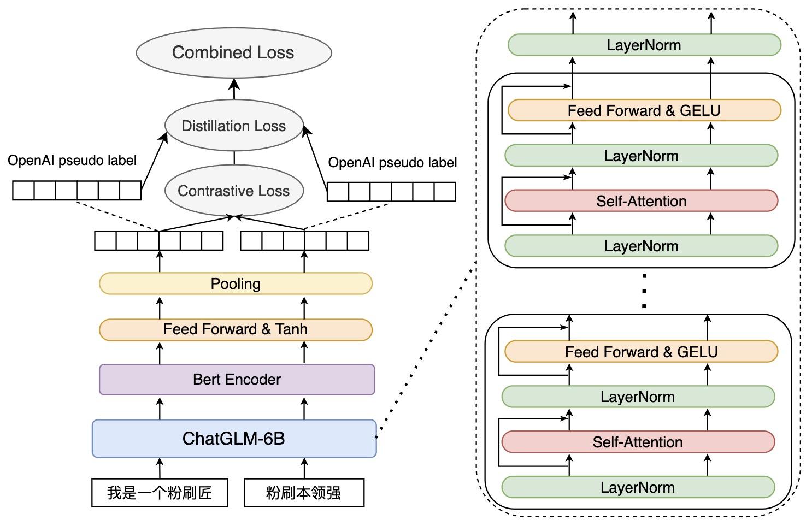

# Luotuo Embedding: Generative Text Embedding Model distilled from OpenAI API

冷子昂 *,  Liu Siyi *, 陈启源 *,  蒟蒻 *, HS *, 641 *, 年 *, 李鲁鲁 *

#### 作者的footnote

作者的顺序是完全随机的，每个人的具体贡献如下:

李鲁鲁提议了整个项目，并完成了初始的实验验证，以及编写了最终的技术报告。

陈启源和HS建立了数据收集的架构，并完成了数据的收集

冷子昂 and 641 实现了训练的代码，并完成了基于GLM的text embedding训练

蒟蒻独立建立了另一套使用BERT等模型的训练代码。

年完成了实验的部分

孙骜完成了CoT的实验部分

## 摘要

## 引言

近年来，随着大型语言模型的发展，出现了以ChatGPT为首的很多新型应用。并且围绕着OpenAI开放的文本分类、文本Embedding和文本生成的几个接口，涌现了诸如NotionAI, Cursor, Copilot, ChatPDF等多种多样化的应用。

伴随着Meta开源LLaMA语言模型，并且结合对话型的指令调优(alpaca)，以及low rank adaptation的训练技术(alpaca-lora)。在最近的半年中，出现了大量的开源模型训练项目。他们往往可以利用较少的训练资源进行训练，并适配到多种不同的目标语言(葡萄牙、日本、中文)，以及垂直任务中(CoT)。

这些开源项目往往聚焦在文本生成，对于文本理解的处理，follow [GPT3的论文], 往往采用in-context-learning的形式。这是由于Decoder-based的语言模型，使用这种处理方式是更直接的，不需要额外的训练。不过，一方面在很多GPT3之后出现的应用中，很多开发者选择调用OpenAI的embedding接口，来进行语言理解的任务；另一方面，由于feature based的学习方法，能够使用更结构化的数据，并且使用更经典的机器学习架构，更便于传统文本理解研究者来使用。

TODO: 这里补充OpenAI的图在一起

    

+ embed_compare_fig1 , 根据 [OpenAIembedding论文] 的假设，在文本中间切开，前半部分和后半部分的文本embedding应该出现较强的相关性。在这个初步的实验中，我们调用了 [字节的数据集] 中的100条数据，并且将其从最接近中间的句号切开，分别在三个模型上测试了前半部分文档和后半部分文档的Embedding的余弦相似度。 可以发现，在OpenAI的API接口中，文本的相关性得到了有效的体现，即使前文和后文没有太多的重复词汇，也能够在对角线上体现很高的相关性。而BERT，由于采用的是文本dropout训练的方式，对于文本前后文的关联，刻画没有那么好的描写。而我们的模型实现了接近OpenAI API的效果。

对此，我们希望能够从现有的开源模型出发，获取一个较好的文本嵌入特征，来对支撑文本检索、文本分类等下游任务的识别。所有的代码包括测试代码、训练代码以及所有训练数据都会逐步清理和开源，供社区使用。我们希望我们的工作能够更好地推动语言模型，特别是中文语言模型的发展。

需要注意的是，从Decoder based的大语言模型中，得到一个Embedding特征，是非琐碎的。[OpenAIembedding论文]使用了[多少数据]规模的语料，在GPT3上进行训练，才获得了state-of-the-art级别的效果。但是无论是数据的部分还是GPT3的模型都是非开源的。这使得之后从Decoder模型中获取text embedding，只有少数的研究和公开代码[CSE那个代码]。本文意在利用较小的计算资源，从已经开源的一些中-英文模型出发，蒸馏得到一个较强的Embedding，以提供给下游更多的应用去使用。

本文的主要贡献是

+ 本文实现了一个通用的Text Embedding开源模型，可以有效支持更多的下游自然语言理解的任务。目前支持中文较长文本的Embedding，未来将进一步支持更多的跨语言任务。

+ 本文提出了一套蒸馏的同时进行自学习的方案，可以同步从一个较大的语言模型中，学习text的embedding。

+ 本文在CoT等实验中，验证了我们提出的Text Embedding的有效性。

## Embedding的特点和相关工作

作为一个self-contain的报告，我们在这里描述一下Text Embedding的基本目标和相关的工作。

+ Text Embedding的训练目标

这里chenqy补充一下？从基础n-gram的embedding，讲到bert，再讲到GPT3那个？

然后讲一下有监督和自学习的loss，我们这里主要是启用了自学习的loss。

图\ref{embed_compare_fig1}中可以看到，我们使用 [字节那个数据集] 中的一部分数据，验证了[openAI那个paper] 的假设。在OpenAI实际给出的API中，前半段的文本和后半段的文本有很强的相关性。因此在本文中，我们主要考虑与 [字节那个数据集] 相同的自监督loss。

+ Text Embedding的下游应用

    

A t-SNE visualization for proposed Embedding. Embedding有着多样化的下游应用，如数据可视化、聚类、搜索、分类等等。

考虑到有很多的监督应用，我们这里主要展示了搜索、文本可视化，以及一个AutoCoT的应用。更多的下游应用我们计划在之后的版本进行补充。

## 损失函数的构造

在本来[OpenAIembedding论文]的工作中，使用了[多少数据]规模的语料。而在我们的工作中，为了在更可支付的计算资源下得到模型，我们希望考虑在单卡A100的情况下，能够在7天级别内训练得到的模型。因此我们考虑了对OpenAI的[embedding模型名字]模型的输出进行蒸馏。

从数学的角度来说，给定文本T1, T2，我们希望得到一个函数f()，如果T1和T2在文本中是相互连接的上下文关系，我们希望f(T1)和f(T2)在consine相似度上尽可能接近;反之，如果T1和T2来自不同的文本，我们希望f(T1)和f(T2)的consine相似度尽可能接近0。

TODO: 这里补一个图，解释3个loss

| L1 | L2 | L3 |
|---|---|---|
| Distill Loss | KL Loss | margin loss |

由于OpenAI已经提供了强特征的接口，即存在一个OpenAI提供的函数g()，已经能够让关联的文本g(T1)和g(T2)抽取得到的embedding特征，在特征空间上足够的近。所以我们考虑在使f(T1)和f(T2)尽可能接近的时候，也同时让f(T1) f(T2)与g(T1)，g(T2)分别对齐。这样做可能存在3个好处: 1. 因为OpenAI的特征已经有很强的监督信息，根据过往的模型蒸馏的报告，在一个较强的指导信息下，会使得f函数的收敛更快，并且在更小的数据上能够熟练。 2. 因为我们只使用了有限的语料，使用OpenAI额外的监督，可以看成引入了一个很强的topic模型，有助于增加小模型的泛化能力。 3.与OpenAI的Embedding对齐，可以有助于我们的模型对接很多已经在使用OpenAI Embedding API的应用。 在这里我们使用OpenAI的text-embedding-ada-002接口作为g函数，对于任意长度输入的文本，这个接口返回1536维的特征。

对于上述的学习目标，我们设计了三个成分的损失函数，分别是蒸馏损失，KL散度损失和Margin损失。

### 蒸馏损失函数

在这里我们假设每次训练时考虑一个Batch的输入\{ (T_1, U_1), ... , (T_N, U_N) \}，其中(T_n , U_n)为一个文本对，我们每次从长度约为300-800的文本中，从接近中间的句号或者换行处切开，将前后的文本分别定义为T_n和U_n。根据 OpenAI论文 的假设，前后的文本应该有较强的相关性。对于每一对文本，我们都通过OpenAI的接口，获得了蒸馏目标的特征(g(T_n), g(U_n))。

蒸馏损失函数的构造非常简单，

L = E_n \[  | f(T_n) - g(T_n) |_p \] + E_n \[ | f(U_n) - g(U_n) |_p \] 

在这里我们初步的实验使用了p=2的MSE损失函数，之后替换为了p=1的l1损失。如果有时间的话我们会补足一个关于p的消融实验。

### KL散度损失

### Margin损失

### Hard Negative挖掘

## 网络架构

### HardNegative Mining与KL散度Loss

在很多关于自学习的中提到[陈启源找一下文献]，仅仅使用简单的Contrastive Learning，对于负样本的学习太过于简单。在文本的Embedding训练中我们可以这样理解，如果两个文本中出现了一些完全topic完全不相关的单词，就很容易让两个文本去区分开。因此，[陈启源找一下文献]考虑在自相关学习中引入Hard Negative Mining的手段。

当然，有很多时候，多个文本语料可能是直接相关的，所以当我们把Hard Negative的样本放在一起的时候，很多Pesudo的Negative样本并不是真正的负样本，如果再使用之前提到的CSE损失函数学习，很容易出现Overfitting。

这个时候，结合OpenAI的输出，我们使用一个KL散度作为Loss，具体来说，在训练的时候，我们试图将Hard Negative尽可能抽样在一起。然后对于一个Batch，如果OpenAI得到的相似度矩阵是P，模型当前得到的矩阵是Q，对于这两个矩阵的第n行，p_n和q_n，我们求KL散度

KL(p_n* ||  q_n* ) = sum_i p_ni log(p_ni / q_ni )

当然，对于列我们也求KL散度，用KL(p_*n ||  q_*n )来表示。

最后，我们将每一列和每一行的KL散度求平均，得到了KL散度Loss

L_KL = 1/2n * sum_n ( KL(p_n* ||  q_n* )  + KL(p_*n ||  q_*n ) )

在第一个版本中，我们先没有使用这个KL散度的实现，我们将在后续放出的模型中使用这个Loss。

TODO:在这张图左边增加两个size的bert，形成a,b,c

    

### BERT作为Backbone
大部分现有的embedding model都是使用Transformer Encoder architecture作为model的backbone（Bert，Roberta）。使用这种架构的好处在于bidirectional encoder能够掌握前后文的信息，从而更好的学习文字的表征。这篇工作同样使用BERT模型作为我们embedding model的backbone。任意一段文本被输入进BERT模型后，会先被BertTokenizer tokenize成input_ids，然后放入embedding层使它向量化，然后通过encoder学习他的表征，最后使用encoder最后一层的[CLS]的hidden states作为这段文本的表征。

### 利用ChatGLM-6b对embedding初始化

不同于之前的embedding model随机（或normal）初始化BERT的embedding layer，[OpenAIembedding论文]的工作提出了一种使用大语言模型初始化encoder的方法。Following their work，我们将input_ids输入进ChatGLM-6b并取他最后一层的hidden states作为我们encoder的input。换言而之，我们抛弃了原生的embedding层，并使用GLM去生成embedding，然后把GLM生成的embedding作为encoder的input去训练，并在训练过程中freeze了GLM的参数。此举旨在利用GLM大的参数量和parametric knowledge去初始化一个较为好的embedding。我们希望这个embedding可以一定程度的保留GLM的知识，并基于它去继续学习。

### 训练的细节

## 数据
CNewSum

## 结果
