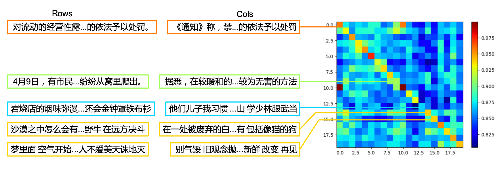

<a name="BigTitle"></a>

English | [快速上手](#quickstart) | [Embedding应用](#application) | [数据](#data) | [赞助](#sponsorship) | [人员](#contributor) | [引用](#cite)

# Luotuo Embedding 骆驼嵌入: Generative Text Embedding Model distilled from OpenAI API

骆驼嵌入是一个文本嵌入(text embedding)模型，由冷子昂, 刘思诣, 黄泓森, 陈舒年, 胡婧, 孙骜, 陈启源, 李鲁鲁等开发

<details>
  <summary> 每个作者都是第一作者，顺序是随机的。(点这里具体)</summary>

李鲁鲁发起了项目，并完成了初步的验证，提出了KL散度Loss和Hard Negative挖掘。

刘思诣完成了初步训练框架的编写，以及支撑了后面模型上传到hugging face管线。

冷子昂完成了完整的大模型和小模型的训练，包括载入数据和损失函数的实现。

陈启源准备了CNewSum的数据，做了句子切分。

黄泓森负责爬取了OpenAI Embedding的数据。

陈舒年完成了重要的几个可视化。

孙骜（即将）用我们的得到的Embedding，完成CoT的提升实验。

胡婧收集了周杰伦的歌词，并（即将）完成更多的定量实验。

</details>

骆驼嵌入是[Luotuo(骆驼)](https://github.com/LC1332/Luotuo-Chinese-LLM)的子项目之一, 后者由李鲁鲁, 冷子昂, 陈启源发起。

<p align="center">
    
</p>

文本嵌入，是指将一段文本，转化为一定维度的向量（1536维），其中相近语义、相关主题的文本在向量空间更接近。拥有一个良好的文本嵌入特征，对于文本可视化、检索、聚类、内容审核等下游任务，有着重要的意义。

+ If you find this helpful, please star our major repo [Luotuo(骆驼)](https://github.com/LC1332/Luotuo-Chinese-LLM), Thanks Very Much

+ 如果你感到这个页面对你有帮助，拜托您去我们[骆驼的主页](https://github.com/LC1332/Luotuo-Chinese-LLM)也点上star，非常感谢！

<a name="quickstart"></a>

## 快速上手

小模型已经发布，中模型将在周一前后发布

|  | Colab链接 | 细节 |
| --- | --- | :--- |
| 小模型 | - | BERT 110M带可视化验证的notebook |
| 中模型 | - | BERT 352M带可视化验证的notebook |
| 大模型 | - | GLM-Encoder模型带可视化验证的notebook |
| 小模型Minimal | - | BERT 110M最简代码的notebook |
| 小模型Minimal | - | BERT 352M最简代码的notebook |
| 大模型Minimal | - | GLM-Encoder模型最简代码的notebook |


<a name="application"></a>

## Embedding应用

- [文本数据可视化](#sec-visual) 任意文本分类数据的可视化

- [文本相关性测试](#sec-CSE) 周杰伦歌词之间的相关性测试。

- [文本的模糊搜索](#sec-IR) 周鸿祎为什么喜欢穿红衣？

- [文本聚类](#sec-grouping) 找呀找呀找朋友

- [少样本的分类学习](#sec-classificationg) 用embedding解决审核任务


<a name="sec-visual"></a>

### 文本数据可视化


对于任意多类的数据，围绕我们发布的Embedding模型，我们准备了一个特殊的可视化代码，可以将类别展示在二维平面，并抽样展示部分文本的内容。你可以直接在 大模型链接 / 小模型链接 中 运行体验。

<p align="center">
    
</p>

通过可视化看我们可以看到，OpenAI原论文的基本假设基本得到验证，即使是很写意的歌词，在中间切开，去除重复文本之后。前段歌词和后段歌词仍然能够呈现很强的相关性。（除了周杰伦的《爸 我回来了》，其他的）歌曲的前后段在特征空间中都很接近。

<a name="sec-CSE"></a>

### 文本相关性测试

在OpenAI的论文(补充引用)中，使用了大量文本（补充数量）来进行自监督学习。其关键假设是，在切开的文本中，连续的两段长文本是相关的。在这个应用中，我们会在两个测试上验证这个假设。因为我们目前版本的模型的训练数据都是新闻，我们想找两批不同领域的语料，来验证模型的能力。

+ 网文新闻数据: 我们选取了15篇网文，并且加上了15篇数据集中不覆盖的新闻数据。并且寻找语料中的大段落，进行前后的切分。在网文数据中，为了增加挑战性，我们避免切分前后的数据出现过多重复的词汇。

+ 周杰伦挑战: 由于新闻数据前后文中会有一定数量重复的词汇，而网文叙述的连贯性也很强。所以我们想做一个更难的挑战，我们选取了3篇中学课文，2篇网文，5首王菲的歌，以及8首不同内容的周杰伦的歌。并且在这个挑战中，切分后的前文和后文中，我们人工去除了重复的短句（如副歌），并避免重复的词汇。

下面是周杰伦的第一张专辑中，一首sour爵士风格的叙事歌曲《印第安老斑鸠》在切分后的前后歌词

```
前半句:沙漠之中怎么会有泥鳅 话说完飞过一只海鸥 大峡谷的风呼啸而过 是谁说没有 有一条热昏头的响尾蛇 无力的躺在干枯的河 在等待雨季来临变沼泽 灰狼啃食着水鹿的骨头 秃鹰盘旋死盯着腐肉 草原上两只敌对野牛 在远方决斗

后半句:在一处被废弃的白蚁丘 站着一只饿昏的老斑鸠 印地安老斑鸠腿短毛不多 几天都没有喝水也能活 脑袋瓜有一点秀逗 猎物死了它比谁都难过 印地安斑鸠 会学人开口 仙人掌怕羞 蜥蝪横着走 这里什么奇怪的事都有 包括像猫的狗
```

####  

<p align="center">
    
</p>

在这个测试中，我们使用一些训练数据(新闻数据)完全不覆盖的语料数据(中学语文课文和流行音乐歌词)，来进行测试。我们使用了如下的数据

4篇语文课文和一篇网文中的段落:《从百草园到三味书屋》, 《背影》,《出师表（现代文版）》,《雷雨》和《凡人修仙传》

5首周杰伦的架空世界观歌曲:《印第安老斑鸠》《三年二班》《双截棍》《威廉古堡》《米兰的小铁匠》

5首周杰伦的失恋情歌:《反方向的钟》 《搁浅》《完美主义》《黑色幽默》《对不起》

5首周杰伦的家庭类歌曲:《爸 我回来了》《上海 一九四三》《爷爷泡的茶》《外婆》《听妈妈的话》

为了进一步增加难度，我们在抽取的时候尽量避免前后的文本中，出现重复的关键字，如《印第安老斑鸠》的歌词如下


我们通过这20对语料来向读者展示Embedding的特点。


+ TODO: 胡婧收集语料

+ TODO: 收集语料在大、小模型上的embedding

+ TODO: 补充结论段

<a name="sec-IR"></a>

### 模糊问题搜索

+ TODO

<a name="sec-grouping"></a>

### 文本聚类

+ TODO

<a name="sec-classification"></a>

### 少样本的分类学习

+ TODO

## 例子代码

## 训练方法

在训练中我们使用了三项Loss， 第一项是对OpenAI的feature求MSE的Loss（其实我估计L1更好）; 第二项是CSE Loss，也就是对文本对求相似度矩阵之后，横向和纵向，以对角为ground truth标签，求cross entropy; 第三项是KL散度的loss，对openAI得到的相关性矩阵P，和模型当前得到的相关性矩阵Q，按行和列分别求KL散度。

具体的内容可以看我们正在编写的[报告](./report.md)，等定量实验完成一些后，我们会先挂出中文的arxiv，方便大家引用我们的工作。补充更多定量实验之后，我会翻译成英文。

### BERT模型

对于BERT模型，我们增加了一个全连接层使得BERT的特征能够提升到1536维，并且使用沈向洋老师IDEA发布的中文CLIP模型为起点开始，进行训练，在所有数据上训练了总共5个Epoch。

### GLM模型

对于GLM模型，对于一个句子输入，我们获得Tokenizer后每一个input token在GLM的最后一层hidden vector，然后将这个vector通过全连接，依次输入了一个BERT。

这些细节具体可以看我们正在编写的[报告](./report.md)

<a name="data"></a>

## 数据

在骆驼嵌入的训练中，我们使用了234.5K的[CNewSum](https://dqwang122.github.io/projects/CNewSum/)数据。将新闻数据清理后，前后切开，并调用OpenAI的text-embedding-ada-002模型，得到了所有文本对的1536维数据。

我们准备公开这批数据，正在研究CNewSum和OpenAI的数据协议，并且准备申请共享这批数据的表格和网站，之后就会释放这批数据。

另外，将新闻数据训练得到的模型，应用在其他领域（比如修仙网文）可能会有一定的限制。最好再进一步加入对应domain的数据进行进一步的蒸馏训练。如果这方面您有确实的需求，也愿意覆盖数据和算力的费用，可以联系我们团队。（要是加入了部分额外domain数据的训练结果愿意公开给社区就更好了）

<a name="sponsorship"></a>

## 赞助(Sponsorship) 骆驼项目

在训练骆驼嵌入的时候，除了使用社区捐赠的经费购买的远程服务器外

我们还使用了两周 **东吴证券** 捐赠的A100算力，在此表示感谢！

如果你有兴趣赞助骆驼项目，请点击[主项目](https://github.com/LC1332/Luotuo-Chinese-LLM#%E8%B5%9E%E5%8A%A9sponsorships)或者查看[赞助表单](https://github.com/LC1332/Luotuo-Chinese-LLM/blob/main/data/Sponsorship_and_balance.md)

If you are interested in sponsoring the [Luotuo Project](https://github.com/LC1332/Luotuo-Chinese-LLM#%E8%B5%9E%E5%8A%A9sponsorships), please click on the [major project](https://github.com/LC1332/Luotuo-Chinese-LLM) or view the [sponsorship form](https://github.com/LC1332/Luotuo-Chinese-LLM/blob/main/data/Sponsorship_and_balance.md).

<a name="contributor"></a>

## 人员

更详细的整个骆驼项目相关的人员信息，请查看[骆驼项目的主页](https://github.com/LC1332/Luotuo-Chinese-LLM#%E8%B4%A1%E7%8C%AE%E8%80%85contributors)

每个作者都是第一作者，顺序是随机的。

李鲁鲁发起了项目，并完成了初步的验证，提出了KL散度Loss和Hard Negative挖掘。

刘思诣完成了初步训练框架的编写，以及支撑了后面模型上传到hugging face管线。

冷子昂完成了完整的大模型和小模型的训练，包括载入数据和损失函数的实现。

陈启源准备了CNewSum的数据，做了句子切分。

黄泓森负责爬取了OpenAI Embedding的数据。

陈舒年完成了重要的几个可视化。

孙骜（即将）用我们的得到的Embedding，完成CoT的提升实验。

胡婧收集了周杰伦的歌词，并（即将）完成更多的定量实验。


<a name="cite"></a>

## 引用

如果您在项目中使用了我们的模型、代码或者数据，请引用下面第一篇文章。

Please cite the repo if you use the data or code in this repo.

```
@misc{alpaca,
  author={Siyi Liu, Ziang Leng, Hongsen Huang, Shunian Chen, Jing Hu, Ao sun, Qiyuan Chen, Cheng Li},
  title = {Luotuo Embedding: Generative Text Embedding Model distilled from OpenAI API},
  year = {2023},
  publisher = {GitHub},
  journal = {GitHub repository},
  howpublished = {\url{https://github.com/LC1332/Luotuo-Text-Embedding}},
}
```

```
@misc{alpaca,
  author={Ziang Leng, Qiyuan Chen and Cheng Li},
  title = {Luotuo: An Instruction-following Chinese Language model, LoRA tuning on LLaMA},
  year = {2023},
  publisher = {GitHub},
  journal = {GitHub repository},
  howpublished = {\url{https://github.com/LC1332/Luotuo-Chinese-LLM}},
}
```

---

## TODO for RELEASE

- [x] 构建项目页面
- [ ] 发布小模型测试代码
- [ ] 发布大模型测试代码
- [ ] 下游应用——搜索小模型
- [ ] 下游应用——聚类小模型
- [ ] 下游应用——分类小模型
- [ ] 下游应用——搜索大模型
- [ ] 下游应用——聚类大模型
- [ ] 下游应用——分类大模型
- [ ] 翻译页面到英文
- [ ] 发布数据
- [ ] 扩充domain数据，训练一个更好的小模型
- [ ] 扩充domain数据，训练一个更好的大模型
- [ ] 编写arxiv补充实验
- [ ] 清洁并发布训练代码

---


## Report

See our in writing report [here](./report.md)


## A Quick Start

+ Evaluation Code

+ Training Code

## Trained Models


## TODO

Embedding的测试需求

+ query-Answer

- 必须包括 周鸿祎 在360 ChatGPT展示大会的语料内容（ 这部分我可以让我老婆去看一下那个大会）

- 然后就是正常的新闻语料，找个10000个的base就可以

- 例子尽量使用周鸿祎展示的例子

- 额外再给一个别的例子就可以

+ 用户自由输入，进行文档retrieve

这里可以录一个视频

+ t-SNE展示1

这里鲁叔有个特别的t-SNE设计


考虑一个N类的t-SNE。我至多左右展示2M句话

每一句话都有一个展示位置。比如左侧就是 (图像左边界，(i-M/2) * offset)

所以有2M个展示位置

每个类c有一个颜色 (r_c,g_c,b_c)

从数据中，sample 2M个样本点，

然后这2M个样本点关于t_SNE的位置，和2M个展示位置做匹配

样本展示的颜色 = 类颜色 + 30级别的RGB扰动

连线考虑使用横线+斜线，如果算不出来就一根线直接连过去


+ Correspondence展示

<p align="center">
    
</p>

首先，最右侧是热图，热图务必用Jet的色表，务必显示右侧的colorbar

我建议输入格式支持setence pair（分好的） 和combined sentence

如果是combined setence，我有一个strong divide函数可以切开（记得问我要一下）

然后计算vecs（也可以预先载入，如果预先有就不重新计算了）

然后有一个visual_id，选择哪些对角线展示，如果visual_id为空，则均匀抽样

分别显示行和列的文字，并向对角线的元素连线，颜色使用对角线上那个元素的颜色

就是这样

+ 聚类+词云展示

我的colab里面已经有基本的例子

把我的词云加上stop words过滤


+ t-SNE with more data

base语料里面，找3个高频词。

相关的文章形成3个类，展示特征的t-SNE


+ 下游分类任务展示

展示10句A类语料，10句B类语料

然后给定新的句子，判断A类还是B类

+ openAI原假设验证

query和base画对角线热图 


|  | Colab链接 | 细节 |
| --- | --- | :--- |
| 小模型 | <a href="https://colab.research.google.com/github/LC1332/Luotuo-Chinese-LLM/blob/main/notebook/TuoLingC_evaluation_code.ipynb" target="_parent"></a> | BERT带可视化验证的notebook |
| 大模型 | <a href="https://colab.research.google.com/github/LC1332/Luotuo-Chinese-LLM/blob/main/notebook/TuoLingC_evaluation_code.ipynb" target="_parent"></a> | GLM-Encoder模型带可视化验证的notebook |
| 小模型Minimal | <a href="https://colab.research.google.com/github/LC1332/Luotuo-Chinese-LLM/blob/main/notebook/TuoLingC_evaluation_code.ipynb" target="_parent"></a> | BERT最简代码的notebook |
| 大模型Minimal | <a href="https://colab.research.google.com/github/LC1332/Luotuo-Chinese-LLM/blob/main/notebook/TuoLingC_evaluation_code.ipynb" target="_parent"></a> | GLM-Encoder模型最简代码的notebook |


## A Quick Start

+ Evaluation Code

+ Training Code

## Trained Models


## TODO

Embedding的测试需求

+ query-Answer

- 必须包括 周鸿祎 在360 ChatGPT展示大会的语料内容（ 这部分我可以让我老婆去看一下那个大会）

- 然后就是正常的新闻语料，找个10000个的base就可以

- 例子尽量使用周鸿祎展示的例子

- 额外再给一个别的例子就可以

+ 用户自由输入，进行文档retrieve

这里可以录一个视频

+ t-SNE展示1

这里鲁叔有个特别的t-SNE设计


考虑一个N类的t-SNE。我至多左右展示2M句话

每一句话都有一个展示位置。比如左侧就是 (图像左边界，(i-M/2) * offset)

所以有2M个展示位置

每个类c有一个颜色 (r_c,g_c,b_c)

从数据中，sample 2M个样本点，

然后这2M个样本点关于t_SNE的位置，和2M个展示位置做匹配

样本展示的颜色 = 类颜色 + 30级别的RGB扰动

连线考虑使用横线+斜线，如果算不出来就一根线直接连过去


+ Correspondence展示

<p align="center">
    
</p>

首先，最右侧是热图，热图务必用Jet的色表，务必显示右侧的colorbar

我建议输入格式支持setence pair（分好的） 和combined sentence

如果是combined setence，我有一个strong divide函数可以切开（记得问我要一下）

然后计算vecs（也可以预先载入，如果预先有就不重新计算了）

然后有一个visual_id，选择哪些对角线展示，如果visual_id为空，则均匀抽样

分别显示行和列的文字，并向对角线的元素连线，颜色使用对角线上那个元素的颜色

就是这样

+ 聚类+词云展示

我的colab里面已经有基本的例子

把我的词云加上stop words过滤


+ t-SNE with more data

base语料里面，找3个高频词。

相关的文章形成3个类，展示特征的t-SNE


+ 下游分类任务展示

展示10句A类语料，10句B类语料

然后给定新的句子，判断A类还是B类

+ openAI原假设验证

query和base画对角线热图 


|  | Colab链接 | 细节 |
| --- | --- | :--- |
| 小模型 | <a href="https://colab.research.google.com/github/LC1332/Luotuo-Text-Embedding/blob/main/notebook/Luotuo_Embedding_Demo.ipynb" target="_parent"></a> | BERT带可视化验证的notebook |
| 大模型 | <a href="https://colab.research.google.com/github/LC1332/Luotuo-Chinese-LLM/blob/main/notebook/TuoLingC_evaluation_code.ipynb" target="_parent"></a> | GLM-Encoder模型带可视化验证的notebook |
| 小模型Minimal | <a href="https://colab.research.google.com/github/LC1332/Luotuo-Chinese-LLM/blob/main/notebook/TuoLingC_evaluation_code.ipynb" target="_parent"></a> | BERT最简代码的notebook |
| 大模型Minimal | <a href="https://colab.research.google.com/github/LC1332/Luotuo-Chinese-LLM/blob/main/notebook/TuoLingC_evaluation_code.ipynb" target="_parent"></a> | GLM-Encoder模型最简代码的notebook |